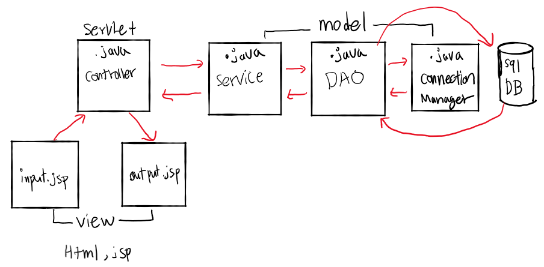

# MVC 디자인

> 각기능이 분리되어있어 개발 및 유지보수가 편리하고 재사용성이 높아진다.
>
> 디자이너와 개발자의 작업을 분업화해서 쉽게 개발할 수 있다.


- Controller
  
  - 서블릿이 컨트롤러 역할을 한다.
  
  - 클라이언트의 요청을 분석한다
  
  - 요청에 대해서 필요한 모델을 호출한다
  
  - Model에서 처리한 결과를 보여주기 위해 JSP를 선택한다
  
  - `ControllerServlet.java`
  
    `web.xml`
  
- Model

  - 데이터베이스 연동과 같은 비지니스 로직을 수행한다

  - 일반적으로 DAO와 VO클래스로 이루어져 있다

  - `BusinessService.java`

    `ConnectionManager.java`

    `JobsDAO.java`

- View
  
  - JSP가 화면 기능을 담당한다
  
  - Model에서 처리한 결과를 화면에 표시한다
  
  - `input_view.html`
  
    `output_view.jsp`


cf) import/export

- export : war Export ->destination설정->export source files 체크 -> finish
- import : war file import



### 동작순서

#### 1. input_view.html

```html
<!--client가 input_view에서 submit하여 web.xml과 연결한다.-->
<!DOCTYPE html>
<html>
<head>
<meta charset="UTF-8">
<title>Input View</title>
</head>
<body>
<!-- ..이 상대경로에서 한칸 위 .은 현재 위치 그래서 ..을 하게 되면 mvc_week5 폴더를 가리키고 거기에 있는 controller를 가리키는데
controller가 mc.sn.controller.ControllerServlet로 맵핑 됐기때문에 일로 간다.-->
<form action = "../controller" method = "get"> 
	<input type = "submit" value = "컨트롤러 연결">
</form>
</body>
</html>
```


#### 2. web.xml

```xml
<!--controller와 맵핑되어있는 controllerServlet과 연결 -->
<?xml version="1.0" encoding="UTF-8"?>
<web-app xmlns:xsi="http://www.w3.org/2001/XMLSchema-instance" xmlns="http://xmlns.jcp.org/xml/ns/javaee" xsi:schemaLocation="http://xmlns.jcp.org/xml/ns/javaee http://xmlns.jcp.org/xml/ns/javaee/web-app_4_0.xsd" id="WebApp_ID" version="4.0">
 <servlet>
 	<servlet-name>controller</servlet-name>
 	<servlet-class>mc.sn.controller.ControllerServlet</servlet-class>
 </servlet>
 <servlet-mapping>
 	<servlet-name>controller</servlet-name>
 	<!-- http://localhost:9090/mvc_week5/day26/input_view.html 와 mc.sn.controller.ControllerServlet 연결하는데 상대경로 사용해서한다.-->
 	<url-pattern>/controller</url-pattern> 
 </servlet-mapping>
</web-app>
```


### 3. controllerServlet.java

```java
//생명주기에따라 init(),doget(),dopost(),destroy()가 실행된다.
package mc.sn.controller;

import java.io.IOException;
import java.io.PrintWriter;

import javax.servlet.ServletException;
import javax.servlet.http.HttpServlet;
import javax.servlet.http.HttpServletRequest;
import javax.servlet.http.HttpServletResponse;
import javax.servlet.http.HttpSession;

import mc.sn.model.BusinessService;

public class ControllerServlet extends HttpServlet {

	@Override
	public void init() throws ServletException {
		// TODO Auto-generated method stub
		System.out.println("init");
	}
	
	@Override
	protected void doGet(HttpServletRequest req, HttpServletResponse resp) throws ServletException, IOException {
		// TODO Auto-generated method stub
		this.doPost(req, resp);
	}
	
	@Override
	protected void doPost(HttpServletRequest req, HttpServletResponse resp) throws ServletException, IOException {
		// TODO Auto-generated method stub
		System.out.println("work");
		resp.setContentType("text/html");
		PrintWriter out = resp.getWriter();
		out.print("<h1>Welcome!! Servlet</h1>");
		BusinessService bs = new BusinessService();//BusinessService 클래스를 사용하여
		String result = bs.checkWorkingDatabase();//값을 받아온다.
		
		HttpSession session = req.getSession();//session의 정의는 한 주제를 다루는 일정한 시간,
		session.setAttribute("result", result);//"result"가 키 값이고 result가 object로 형변환되서 들감
		
		resp.sendRedirect("./day26/output_view.jsp");//이쪽으로 보내라는 매소드
	}
	@Override
	public void destroy() {
		// TODO Auto-generated method stub
		System.out.println("destroy");
	}
}

```


#### 4. BusinessService.java

```java
//ControllerServlet에 호출되고 JobsDAO에게 값을 받아온다.
package mc.sn.model;

import java.sql.SQLException;

public class BusinessService {
	
	public String checkWorkingDatabase() {
		String line = null;
		//동작여부를 테이블의 한 행 정보를 문자열로 구성
		JobsDAO dao = new JobsDAO();
		try {
			line = dao.selectJobs();
		} catch (SQLException e) {
			// TODO Auto-generated catch block
			e.printStackTrace();
		}
		return line;
	}
}

```


#### 5. JobsDAO.java

```java
//BusinessService에게 호출되고 DB와 연결하여 쿼리를 통해 원하는 데이터를 가져온다.
package mc.sn.model;

import java.sql.Connection;
import java.sql.ResultSet;
import java.sql.SQLException;
import java.sql.Statement;

public class JobsDAO {
	//데이터베이스에 대하여 CRUD 작업
	public String selectJobs() throws SQLException {
		String info = null;
		String sql = "select * from jobs";
		Connection con = ConnectionManager.getConnection();
		Statement stmt = con.createStatement();
		ResultSet rs = stmt.executeQuery(sql);
		while(rs.next()) {
			info = rs.getString(1)+","+rs.getString(2)+","+rs.getInt(3);
			break;
		}
//		rs.close();
//		stmt.close();
//		con.close();
		//닫는것도 이렇게 넘겨줘서 한다.
		ConnectionManager.closeConnection(con, stmt, rs);
		return info;
	}
}

```


#### 6. ConnectionManger

```java
//JobsDAO에 호출되어 커넥션을 제공해주는 역할을 한다.
package mc.sn.model;

import java.sql.Connection;
import java.sql.DriverManager;
import java.sql.ResultSet;
import java.sql.SQLException;
import java.sql.Statement;

//커넥션 풀 데이터베이스에 무리를 주지 않고 커넥션을 관리하는 방법
public class ConnectionManager {
	//열고
	public static Connection getConnection()  {
		Connection con = null;
		String jdbcURL = "jdbc:oracle:thin:@localhost:1521:xe";
		String driver = "oracle.jdbc.OracleDriver";
		String id = "hr";
		String pwd = "1234";
		
		try {
			Class.forName(driver);
			con = DriverManager.getConnection(jdbcURL,id,pwd);
		} catch (ClassNotFoundException e) {
			System.out.println("connection problem");
			//e.printStackTrace();
		} catch (SQLException e) {
			System.out.println("driver problem");
			//e.printStackTrace();
		} finally {
			
		}
		return con;
	}
	//닫고 매니저에서 다 해줘야한다. 이렇게
	public static void closeConnection(Connection con, Statement stmt, ResultSet rs) {
		try {
			if(rs!=null) {
				rs.close();
			}
			if (stmt!=null) {
				stmt.close();
			}
			if(con!=null) {
				con.close();
			}
		} catch (SQLException e) {
			// TODO Auto-generated catch block
			e.printStackTrace();
		}
	}
}

```

