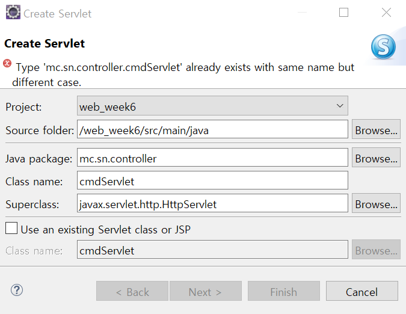

# 어노테이션을 이용한 서블릿 매핑

### 동작 과정

#### 1. create Servlet




#### 2 . next


#### 3. `CmdServlet.java`

```java
package mc.sn.controller;

import java.io.IOException;
import javax.servlet.ServletConfig;
import javax.servlet.ServletException;
import javax.servlet.annotation.WebServlet;
import javax.servlet.http.HttpServlet;
import javax.servlet.http.HttpServletRequest;
import javax.servlet.http.HttpServletResponse;

/**
 * Servlet implementation class CmdServlet
 */
@WebServlet("/cmd")
public class CmdServlet extends HttpServlet {
	private static final long serialVersionUID = 1L;
       
    /**
     * @see HttpServlet#HttpServlet()
     */
    public CmdServlet() {
        super();
        // TODO Auto-generated constructor stub
    }

	/**
	 * @see Servlet#init(ServletConfig)
	 */
	public void init(ServletConfig config) throws ServletException {
		// TODO Auto-generated method stub
	}

	/**
	 * @see Servlet#destroy()
	 */
	public void destroy() {
		// TODO Auto-generated method stub
	}

	/**
	 * @see HttpServlet#doGet(HttpServletRequest request, HttpServletResponse response)
	 */
	protected void doGet(HttpServletRequest request, HttpServletResponse response) throws ServletException, IOException {
		// TODO Auto-generated method stub
		response.getWriter().append("Served at: ").append(request.getContextPath());
	}

	/**
	 * @see HttpServlet#doPost(HttpServletRequest request, HttpServletResponse response)
	 */
	protected void doPost(HttpServletRequest request, HttpServletResponse response) throws ServletException, IOException {
		// TODO Auto-generated method stub
		doGet(request, response);
	}

}

```


#### 3. 실행

