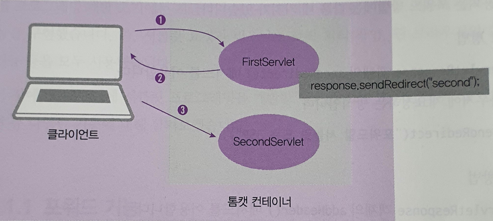
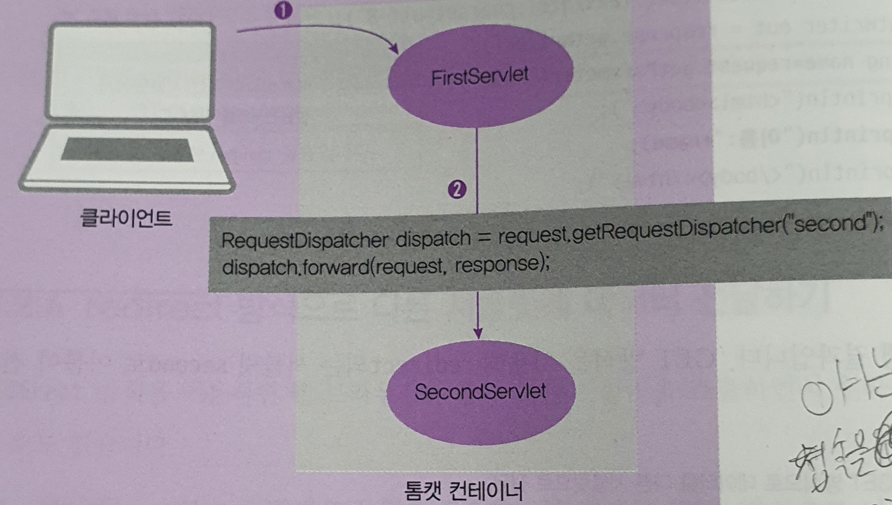

# Servlet forward 기능

> 하나의 서블릿에서 다른 서블릿이나 JSP와 연동하는 방법을 포워드(forward)라고 한다. 

### 서블릿 포워드의 기능

- 요청(request)에 대한 추가 작업을 다른 서블릿에게 수행하게 함
- 요청에 포함된 정보를 다른 서블릿이나 JSP와 공유
- 요청에 정보를 포함시켜 다른 서블릿에 전달
- 모델2 개발 시 서블릿에서 JSP로 데이터 전달 (우리가 했던 MVC예제)

---

### 서블릿 포워드 방법

#### redirect

> 웹의 특징으로 한번 요청하고 처리를 다하면 연결되었던 접속정보가 다 사라지고 새롭게 다시 연결한다.

- `HttpServletResponse` 객체의 `sendRedirect()` 메서드 이용
- 웹 브라우저에 재요청하는 방식
- syntax: `sendRedirect("포워드할 서블릿 또는 JSP")`

#### dispatch

> 얘는 기존의 접속을 다시 접속하여 다른 요청을 수행한다.

- 일반적인 포워딩 기능
- **서블릿이 직접 요청하는 방식**
- `RequestDispatcher` 클래스의 `forward()` 메서드 이용
- syntax: `RequestDispatcher dist = reqeuest.getRequestDispatcher("포워딩할 서블릿 또는 JSP"); dist.forward(request, response);`

----

### 데이터 저장 scope

- request
  - 전달하는때만 존재
  - 한번쓰고 말꺼에 사용
- session
  - 일정한 시간동안 존재
  - 일반적으로 사용
- applicaition(context?)
  - 서버가 죽을때까지 존재
  - 꼭 저장해야하는 것에 사용

- 서블릿 컨텍스트
  - project를 말한다. http://localhost:9090/web_week6~~
  - web_week6 이부분