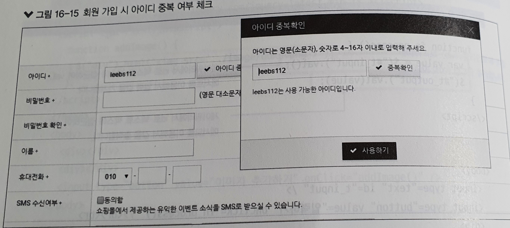

# 9, 13, 14, 16요약

[TOC]

### 9장 쿠키와 세션의 정의

📌**쿠키의 개념**

쿠키는 웹 사이트에 접속할 때 **생성되는 정보를 담은** **임시 파일**

쿠키는 서버가 사용자의 웹 브라우저에 저장하는 데이터를 말합니다.

쿠키의 데이터 형태는 Key 와 Value로 구성되고 String 형태로 이루어져 있습니다.

> 브라우저마다 저장되는 쿠키는 다릅니다. (크롬으로 남긴 쿠키는 인터넷 익스플로어에서 사용할 수 없습니다.)
> 서버에서는 브라우저가 다르면 다른 사용자로 인식합니다.

 

쿠키는 서버를 대신해서 이러한 정보들을 웹 브라우저에 저장

(정확히는, 웹 브라우저를 이용하고 있는 컴퓨터에 저장)하고

사용자가 요청을 할 때 그 정보를 함께 보내서 서버가 사용자를 식별할 수 있게 해줍니다.


📌**쿠키의 사용목적**

쿠키는 주로 아래의 세 가지 목적을 위해 사용됩니다.

\1. **세션 관리**(Session Management) 로그인, 사용자 닉네임, 접속 시간, 장바구니 등의 서버가 알아야할 정보들을 저장합니다.

\2. **개인화**(Personalization) 사용자마다 다르게 그 사람에 적절한 페이지를 보여줄 수 있습니다.

\3. **트래킹**(Tracking) 사용자의 행동과 패턴을 분석하고 기록합니다.

 

📌**쿠키가 사용되는 예시**

쿠키가 있기 때문에 여러 페이지를 이동할 때마다 로그인을 하지 않고 사용자 정보를 유지할 수 있는 것입니다.

쿠키가 없다면 다음 페이지로 정보를 파라미터로 넘겨줘야 합니다.

 

- ID 저장, 로그인 상태 유지
- 일주일간 다시 보지 않기.
- 최근 검색한 상품들을 광고에서 추천
- 쇼핑몰 장바구니 기능


📌**세션의 특징**

세션 아이디는 웹 브라우저 당 1개씩 생성되어 웹 컨테이너에 저장되며 브라우저 종료시 소멸됩니다.

로그인한 사용자에 대해서만 세션을 생성하는 것이 아니라 

로그아웃하면 새로운 사용자로 인식해서 새로운 세션이 생성됩니다.

(참고로 쿠키는 내 웹브라우저에 저장된 것이기 때문에 로그아웃 유무와 관계없이 삭제하지 않으면 유지됩니다.)

 

아이디, 닉네임 등의 정보를 세션에 담아두면 요청이 있을 때 마다, DB에 접근할 필요가 없어서 효율적입니다.

💡**간단요약**


쿠키와 세션 비교


출처: https://devuna.tistory.com/23 [튜나 개발일기]


---


### 13장 자바코드를 없애는 액션 태그

>자바 코드 -> 태그 
>
>원래 html태그에는 없는 기능으로써 자바문법을 대신하는 jsp가 제공하는 태그들

태그를 식별(그림)의 기능이 아니라 동작의 기능(코드)으로 발전 시켰다. 근데 이제는 이렇게 안쓴다 예전 방식임

JSP는 스크립트릿의 자바 코드를 제거하고 디자이너 입장에서 더 쉽고 편리하게 작업할 수 있는 태그 형태로 기능을 제공하게 되었고, 다음과 같은 액션 태그들로 자바 코드를 대신하게 되었다. 


#### jsp 액션태그의 종류

- 주요 액션 태그

  ① forward : 다른 페이지의 이동과 같은 페이지의 흐름을 제어한다. // 컨트롤을 누가 갖고 있냐?
  ② include : 외부 페이지의 내용을 포함하거나 페이지를 모듈화 한다. // 디렉티브 include와 차이점
  ③ param : 파라미터를 얻음
  ④ useBean : 자바 빈즈를 사용하기 위해 실제 자바 클래스를 선언하고 초기화한다.
  ⑤ setProperty : 자바빈즈의 property를 설정
  ⑥ getProperty : 자바빈즈의 property를 얻음

​		<jsp:useBean> 객체를 생성하기 위한 new 연산자를 대신하는 태그

​		<jsp:setProperty> setter 를 대신함

​		<jsp:getProperty> getter 를 대신함


**⑤ useBean 액션 태그**
: **자바 빈즈를 사용하기 위해 실제 자바 클래스를 선언하고 초기화**하는 태그
<jsp:useBean id="식별자" class="자바빈즈 이름" scope="범위" />

\- scope 속성 : 자바 빈즈 범위
\- page : 해당 jsp 페이지에서만 운영할 것인지.
\- request : 사용자의 요청을 처리할 동안에만 할 것인지.
\- session : 접속을 종료할 때까지 할 것인지.


출처 : https://jihyeong-ji99hy99.tistory.com/96


---


### 14 표현 언어(EL)와 JSTL

> 정의와 등장배경 정도 알자. 똑같은 기술을 이용하는 다른것으로 쓰인다

`EL`은 **E**xpression **L**anguage의 약자로 직역하면 표현 언어입니다. EL은 JSP에서 자바코드와 JSP 스크립트 코드를 더욱 더 간결하게 하기 위해 등장하였습니다. EL을 이용하면 여러줄에 걸친 자바코드를 간결하게 표현 가능하게 해줍니다.

예를 들어 기존의 JSP 표현식(`<%= =%>`)을 사용하여 요청객체로부터 특정 값을 꺼내와 출력하는 경우의 코드는 아래와 같습니다.

```jsp
<%
   String id = request.getParameter("id");
%>  
 
<%= id %>

그런데 위의 코드를 `EL`로 바꾸면 아래와 같이 바뀝니다.

​```jsp
${param.id}
```

이렇게 불필요한 코드를 매우 줄여주기 때문에 JSP 페이지의 전체적인 코드가 간결해지고 자바코드가 줄어듦으로써 디자인적 요소(HTML, CSS)와 자바코드를 서로 구분하기 쉬워지는 장점이 있습니다.


**JSTL(JSP Standard Tag Library)**

- JSTL: JSP 페이지에서 조건문, 반복문 처리 등을 HTML tag 형태로 작성할 수 있게 해주는 라이브러리


### 표현 언어의 등장 배경

JSP/Servlet에는 여러가지 기술들이 있습니다. Servlet부터 JSP, 액션태그, JSTL, EL 등 너무 많은데 이러한 기술들은 서로를 보완하기 위해 차례대로 기술이 발전함과 동시에 등장하였습니다.

처음에는 `Servlet`만을 사용하다가 Java 코드에 HTML 코드가 마구 섞여 있는 Servlet의 특성상 디자이너와 서버 개발자간의 협업이 어려운점과 유지보수 측면에서 너무 좋지 못한 점으로 인해 `JSP`가 등장했습니다.

그러다가 JSP에서도 HTML과 JSP 스크립트에서의 Java 코드가 마구 섞이게 되자 이를 극복하고자 Java 코드 보다는 HTML과 비슷하게 보이는 `액션태그`가 등장하였고 액션태그의 부족한 기능을 보완하기 위해 `커스텀태그`, `JSTL`, `EL`이 등장한 것입니다. 정리하자면 다음과 같습니다.

1. 최초에는 `Servlet` 위주의 개발. Servlet 코드 안에 디자인적 요소(HTML, CSS)가 덕지덕지 들어가있는 형태로 디자이너와의 협업 및 유지보수에 좋지 못했음.
2. `JSP`라는 스크립트 기반의 기술이 등장하여 Servlet과는 반대로 디자인적 요소(HTML, CSS)에 Java 코드가 섞여있는 느낌의 형태를 가짐.
3. JSP도 코드가 길어질수록 디자인요소와 Java 코드가 복잡하게 섞이게 되어 간결화할 필요가 있어짐.
4. HTML과 같은 태그 기반의 `액션태그`가 등장함.
5. 액션태그의 기능을 직접 개발하여 사용할 수 있는 커스텀 태그가 등장함.
6. 커스텀태그가 많이 쓰이자 이를 공통모듈로 묶은 `JSTL`과 `EL`이 등장하고 JSTL 1.0에 EL이 포함됨.
7. `JSTL`에서만 동작하던 `EL`은 `JSP 2.0`부터 JSP 내부스펙으로 포함됨.
8. `JSP2.3`을 기준으로 `EL`(표현언어)의 버전은 `3.0`임.


출처: https://til-devsong.tistory.com/29 [주니어 개발자의 기록보관소]

출처: https://dololak.tistory.com/746 [코끼리를 냉장고에 넣는 방법]


---

### 16. 제이쿼리 

> 화면의 동적 기능을 자바스크립트보다 좀 더 쉽고 편리하게 개발할 수 있게 해주는 자바스크립트 기반 라이브러리이다. 제이쿼리는 여러가지 효과나 이벤트를 간단한 함수 호출만으로 빠르게 개발할 수 있다.

- ajax 사용하기  
  - jQuery 이용하기

- 웹 페이지 일부분의 데이터 변경이 필요할 때
  - 데이터 처리는 서버에서 수행
- 이동 데이터의 형태는 json으로 처리

AJAX가 jQuery 고유의 기능은 아니다. 하지만 jQuery는 간단한 문법으로 AJAX를 사용할 수 있게 도와준다. 

### AJAX

AJAX란 **asynchronous Javascript + XML**이다. 기존의 웹에서는 한 번 페이지를 로딩하면 다른 페이지를 로딩하기 위해서 링크를 타고 넘어가야 했다. 그렇게 되면 흔히 말하는 페이지 깜빡임이 발생한다.

AJAX를 사용하면 이름처럼 **비동기적**으로 서버에 요청을 하여 **페이지 전환 없이**도 다음과 같이 아이디 중복 확인이라는 창과 같이 새로운 데이터를 가져올 수 있다. 




- 제이쿼리 AJAX 코드

> jQuery에서는 ajax() 함수를 사용하면 매우 편리하게 서버와 통신할 수 있다.

```jsx
$.ajax({
  url: '주소', // 요청할 url을 입력한다.
  type: 'get 또는 post', // 통신 타입을 설정합니다. POST 또는 GET을 사용할 수 있다.
  async : "true 또는 false", // 비동기 호출 전송 설정 값으로 true/false 를 선택하고 기본값은 true다.
  data: {
      {name : "홍길동"},// 서버에 요청 시 전송할 파라미터를 기입한다. (key / value 형식의 객체)
  },
  dataType: 'json, xml, script, text, jsonp 또는 html'
    		//'서버에 전송 받을 데이터 형식'
  			// 선언하지 않으면 default는 서버가 주는 응답의 mimetype을 기본으로 한다.
  timeout : 10000,  // 요청에 대한 응답 제한 시간으로 단위는 millisecond 이다.
  contentType : "application/json",  // 서버에 데이터를 보낼 때 형식을 지정한다. 기본값은 "application/x-www-form-urlencoded"이다.
  
  // HTTP 요청 전에 발생하는 이벤트 핸들러 이다.
  beforeSend : function() {

  ​      

  },
  success: {
    //정상 요청, 응답 시 처리
  },
  error: function(xhr,status,error) {
    // 오류 발생 시 처리, 동작
},
  complete: function(data,textStatus) {
    // 작업 완료 후 처리
  }
});
```


- xml 데이터 연동시 find를 사용한다.


### JSON

- JSON은 경량(Lightweight)의 DATA-교환 형식
- Javascript에서 객체를 만들 때 사용하는 표현식을 의미한다.
- JSON 표현식은 사람과 기계 모두 이해하기 쉬우며 용량이 작아서, 최근에는 JSON이 XML을 대체해서 데이터 전송 등에 많이 사용한다.
- 특정 언어에 종속되지 않으며, 대부분의 프로그래밍 언어에서 JSON 포맷의 데이터를 핸들링 할 수 있는 라이브러리를 제공한다.

- name/value 쌍으로 이루어진 데이터 객체를 전달하기 위해 인간이 읽을 수 있는 텍스트를 사용하는 개방형 표준 데이터 형식 


1) 문자열인경우

2) 오브젝트인 경우 


```js
{

    "이름": "테스트",

    "나이": 25,

    "성별": "여",

    "주소": "서울특별시 양천구 목동",

    "특기": ["농구", "도술"],

    "가족관계": {"#": 2, "아버지": "홍판서", "어머니": "춘섬"},

    "회사": "경기 수원시 팔달구 우만동"

 }
```


자. 먼저 JSON은  name - value 형태의 쌍으로 이루어져있어요. 

예를들어 "나이"가 name이고 value가 25인거죠.

이때, name인 애들은 **무조건 String이기때문에 반드시 큰따옴표로 묶어줘야한답니다.** 

만약 value도 String이라면, 큰따옴표로 묶어줘야겠죠? 하지만 25는 String이 아니기 때문에 큰따옴표로 안묶어준 것입니다.


이제 JSON이라는 큰 숲을 본거에요. 이제 나무들을 보러가봅시다.


자, 첫번째 줄. { <- 중괄호로 시작되네요. 

이 중괄호의 의미는, 이제 객체(Object)가 나올거야! 라는 소리입니다. 

**JSON에서의 객체는, 위에서 말한 name-value의 쌍의 집합**입니다. 

다시 한번말하지만, 여기서 **name은 반드시 String**이며, value는 기본 자료형이거나 배열, 객체입니다. 또한, 각 쌍들은 쉼표(,)로 구분돼요. 

또한 name 과 value는 콜론(:)으로 이어져있습니다. 

"나이" : 25 

이렇게요.

또한 쉼표로 각 쌍들이 구분되어 있는 것. 보이시죠?ㅎㅎ


가장 첫줄에 {

그리고 가장 마지막줄에 }. 즉 객체가 하나 나왔네요. 

그 객체안에 name-value의 쌍이 있는 것입니다. 


그런데, 잘 보면 

```js
"특기": ["농구", "도술"],
```


이부분, 대괄호가 나왔네요..?

한번 살펴봅시다.


JSON에서 대괄호([])의 의미는 "**배열**"을 의미해요. 

배열의 각 요소는 저기 예제처럼 기본 자료형(String)이어도 되고, 배열, 객체여도 괜찮아요.

배열안에 배열..방금 배열은 []로 나타낸다며..?또..배열안에 객체요?...JSON에서 객체는 위에서 {}로 나타낸댔는데..이 두개가 배열안에 들어가도 되나요..?


네! 됩니다. 다음 예제를 보실까요? 

```
[ 10, {"v": 20}, [30, "마흔"] ]
```

자, 대괄호( [ )로 시작했으니 이건 배열을 나타내는 것이겠네요. 이 안에는 **기본자료형**(10), **객체** ({ "v" : 20 }) , **배열**([30,"마흔])이 들어갈 수 있는것이죠!

주의하실점은 **객체는 반드시 name-value의 쌍**이라는 것. 잊지마세요.


또한, 

```
"특기": ["농구", "도술"],
```

위에서 제가 뭐랬죠?

이 특기 쌍 또한 {}안에 있으니 name-value의 쌍입니다.

name에는 String이 들어갔는데, value에는 배열이 들어왔네요?

제가 위에서 언급했다시피,

"여기서 name은 반드시 String이며, value는 기본 자료형이거나 배열, 객체입니다. 또한, 각 쌍들은 쉼표(,)로 구분돼요."

value는 배열, 또는 객체여도 됩니다. 우리는 지금 value가 배열인 것을 본거죠.


```js
{
    "이름": "테스트",

    "나이": 25,

    "성별": "여",

    "주소": "서울특별시 양천구 목동",

    "특기": ["농구", "도술"],

    "가족관계": {"#": 2, "아버지": "홍판서", "어머니": "춘섬"},

    "회사": "경기 수원시 팔달구 우만동"
 }
```

자, 그럼 여기서 value가 "객체"인 것은 무엇일까요?

네!!맞습니다. 객체는 {} 중괄호를 사용한댔죠? 

```js
    "가족관계": {"#": 2, "아버지": "홍판서", "어머니": "춘섬"},
```

이부분이 value로 객체를 사용한 부분이 되겠네요.

중괄호로 시작했으니까!!!XD


자. 잊어버리시면 안돼요. JSON에서 객체는 뭐라구요?

**"name-value쌍들의 집합"**입니다. 무조건 쌍들로 나타나야해요. 또한, 그 쌍들은 쉼표로 구분되어야 합니다.

자 한번 보세요! 잘 나와있나요? 


네. 잘나와있는것 같아요. 

각 name은 큰따옴표로 잘 묶여있고,

 value도 있고, 

name-value가 콜론으로 잘 이어져있고,

 각 쌍들이 쉼표로 잘 구분되어있네요.


이제 여러분은 JSON이 어떻게 이루어졌는지 이제 다 아는거에요!!!!!XD

축하드려요. 

그럼 위에서 했던 질문. 

이걸 왜 파싱해?

간단하죠. 저희는 이렇게 JSON형태로 온 데이터들을 파싱, 음..데이터를 뽑아낸다고 말하는게 좋을까요?

저 형태로는 저 데이터들을 이용할 수 없으니까요. 

우리는 저기서 데이터들을 뽑아서 

아 이름이 테스트고, 나이가 25고.. 배열 또는 딕셔너리 형태로 저장해야 저 데이터들을 쓸 수 있겠죠?

그래서 다들 JSON 파싱 파싱 그러는거랍니다. 


출처: https://zeddios.tistory.com/90 [ZeddiOS]


1. JSON.parse

서버에서 json dataq쿼리의 결과값은 객체(object) 형태로 유입되기 때문에 이럴 

경우는 자바스크립트가 사용 할 수 있는 객체 형태로 해석하고 변환할 필요가 있다

```js
// Sever Object

var SERVER_OBJ = '{"이름": "김자바","직업": "개발자","나이": "20"}';

var parse = JSON.parse(SERVER_OBJ);

console.log(parse);

// 결과 => Object {이름: "김자바", 직업: "개발자", 나이: "20"} 
//이와 같이 객체.필드 형태로 사용하고자 한다면 반드시 JSON.parse 를 거쳐야 한다.
```


2. JSON.stringify 

데이터를 서버에 전송하고자 할 때는 

문자열(string) 형태로 전송해야 되므로 stringify를 사용한다.

```js
var stringify = JSON.stringify(parse);

console.log(stringify);

// 결과 => {"이름":"김자바","직업":"개발자","나이":"20"}
```

주의 할점은 반드시 "key" : "value"는 따옴표로 감싸지는 형태가 되어야함
