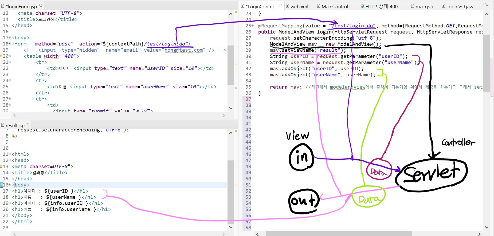

# 스프링 애너테이션

>- 어노테이션 : 코드를 줄이는 역할을 한다..
>- 기존에 XML에서 하던 빈 설정을 애너테이션을 이용해서 자바 코드에서 설정하는 방법
>- 기능이 복잡해짐에 따라 XML에서 설정하는 것보다 유지 보수가 유리하다
>- 현재 애플리케이션 개발 시 XML 설정 방법과 애너테이션 방법을 혼합해서 사용한다.


**cf) javaw.exe <-- tomcat 이여서 작동안될시 이것을 작업 끝내기하고 다시 실행하면 된다.**


---


## 예제를 통해서 이해를 해보자

### 1. URL 요청 실습




- `MainController.java`

>modelandview는 서블릿이라고 볼수있고 ~.jsp와 연결하는 정보를 가지고 있고 spring.jar안에 정의되어 있다. 모델이랑 뷰랑 같이 처리한다. main1이 입력뷰 이름

```java
package com.spring.ex01;

import javax.servlet.http.HttpServletRequest;
import javax.servlet.http.HttpServletResponse;

import org.springframework.stereotype.Controller;
import org.springframework.web.bind.annotation.RequestMapping;
import org.springframework.web.bind.annotation.RequestMethod;
import org.springframework.web.servlet.ModelAndView;
//http~~이거 상속안받아도 되네 init doget 이런 클래스 있던거
@Controller("mainController")
@RequestMapping("/test")
public class MainController {
   @RequestMapping(value="/main1.do" ,method=RequestMethod.GET)
   //modelandview는 ~.jsp와 연결하는 정보를 가지고 있고 spring.jar안에 정의되어 있다. 모델이랑 뷰랑 같이 처리한다. main1이 입력뷰 이름
   public ModelAndView main1(HttpServletRequest request, HttpServletResponse response)  throws Exception{
      ModelAndView mav=new ModelAndView(); 
      mav.addObject("msg","main1"); //key/value
      mav.setViewName("main"); //main이 출력뷰의 이름
      return mav;
   }

   @RequestMapping(value="/main2.do" ,method = RequestMethod.GET)
   public ModelAndView main2(HttpServletRequest request, HttpServletResponse response) throws Exception{
      ModelAndView mav=new ModelAndView();
      mav.addObject("msg","main2");
      mav.setViewName("main");
      return mav;
   }
}
```

- `main.jsp`

```jsp
<title>결과창</title>
</head>
<body>
<h1>안녕하세요!!</h1>
<h1>${msg} 페이지입니다!!</h1>
</body>
</html>

```


### 2. 로그인 기능 구현

#### `LoginController.java`

```java
@Controller("loginController")
public class LoginController {
	@RequestMapping(value = { "/test/loginForm.do", "/test/loginForm2.do" }, method = { RequestMethod.GET })
	public ModelAndView loginForm(HttpServletRequest request, HttpServletResponse response) throws Exception {
		ModelAndView mav = new ModelAndView();
		mav.setViewName("loginForm");
		return mav;
	}
	
    @RequestMapping(value = "/test/login.do", method={RequestMethod.GET,RequestMethod.POST})
	public ModelAndView login(HttpServletRequest request, HttpServletResponse response) throws Exception {
		request.setCharacterEncoding("utf-8");
		ModelAndView mav = new ModelAndView();
		mav.setViewName("result");
		String userID = request.getParameter("userID");
		String userName = request.getParameter("userName");
		mav.addObject("userID", userID);
		mav.addObject("userName", userName);

		return mav; //리턴해서 modelandview에서 출력이 되는거임 위에서 세팅을 하는거고 그래서 set이 먼저 와도 no 상관
	}

```


- 메서드에 @RequestParam 적용

```java

	@RequestMapping(value = "/test/login2.do", method = { RequestMethod.GET, RequestMethod.POST })
	public ModelAndView login2(@RequestParam("userID") String userID, 
			                  @RequestParam("userName") String userName, 
                               //이렇게 하면 밑에 주석친 부분을 대신할 수 있다.
			                  HttpServletRequest request, HttpServletResponse response) throws Exception {
		request.setCharacterEncoding("utf-8");
		ModelAndView mav = new ModelAndView();
		mav.setViewName("result");
		
		// String userID = request.getParameter("userID"); 
		// String userName = request.getParameter("userName");
		
		System.out.println("userID: "+userID);
		System.out.println("userName: "+userName);
		mav.addObject("userID", userID);
		mav.addObject("userName", userName);

		return mav;
	}

```


- @RequestParamdml required 속성 사용하기

>- @RequestParam 적용 시 required 속성을 생략하면 기본값은 true
>- true : 메서드 호출 시 반드시 지정한 이름의 매개변수를 전달해야한다.
>- false : 메서드 호출 시 지정한 이름의 매개변수가 전달되면 값을 저장하고 없으면 null을 할당

```java
	@RequestMapping(value = "/test/login2.do", method = { RequestMethod.GET, RequestMethod.POST })
	public ModelAndView login2(@RequestParam("userID") String userID, 
                               @RequestParam(value="userName", required=true) String userName,
			                   @RequestParam(value="email", required=false) String email,
			                  HttpServletRequest request, HttpServletResponse response) throws Exception {
		request.setCharacterEncoding("utf-8");
		ModelAndView mav = new ModelAndView();
		mav.setViewName("result");
		
		// String userID = request.getParameter("userID");
		// String userName = request.getParameter("userName");
		
		System.out.println("userID: "+userID);
		System.out.println("userName: "+userName);
		System.out.println("email: "+ email);
		mav.addObject("userID", userID);
		mav.addObject("userName", userName);
		return mav;
	}
```


- `result.jsp`

```jsp
<h1>아이디 : ${userID }</h1>
<h1>이름   : ${userName }</h1>
```


---


- map에 매개 변수 값 설정

>Map의 이름 : info, key : 앞 string, value : 뒤 string

```java
@RequestMapping(value = "/test/login3.do", method = { RequestMethod.GET, RequestMethod.POST })
	public ModelAndView login3(@RequestParam Map<String, String> info,//key/value
			                   HttpServletRequest request, HttpServletResponse response) throws Exception {
		request.setCharacterEncoding("utf-8");
		ModelAndView mav = new ModelAndView();
		
		String userID = info.get("userID"); //key를 통해 값을 받는다
		String userName = info.get("userName"); //key를 통해 값을 받는다2
		System.out.println("userID: "+userID);
		System.out.println("userName: "+userName);
		
		mav.addObject("info", info);
		mav.setViewName("result");
		return mav;
	}
```


- ### **vo에 매개변수 값 설정**(추천~!)

> @ModelAttribute를 사용하면 VO클래스의 속성에 매개변수 값이 자동으로 설정된다.
>
> @ModelAttribute("info") LoginVO loginVO라고 작성하면 addObject를 할 필요가 없다
>
> 여기선 key : info, value : loingVO(인스턴스) 값이자 인스턴스이기 때문에 바로 값이 VO 인스턴스에 들어가게 된다.

```java
@RequestMapping(value = "/test/login4.do", method = { RequestMethod.GET, RequestMethod.POST }) //input : test/login4.do 
	public ModelAndView login4(@ModelAttribute("info") LoginVO loginVO,
			                   HttpServletRequest request, HttpServletResponse response) throws Exception {
		request.setCharacterEncoding("utf-8");
		ModelAndView mav = new ModelAndView();
         //이렇게 loginVO인스턴스에에 직접 들어가 있다는것을 확인시켜준다.
		System.out.println("userID: "+loginVO.getUserID());
		System.out.println("userName: "+loginVO.getUserName());
       
		mav.setViewName("result"); //output
		return mav;
	}
```


- result.jsp

> 여기선 info가 인스턴스

```jsp
<h1>아이디 : ${info.userID }</h1>
<h1>이름   : ${info.userName }</h1>

LoginVO info = (LoginVO) sesstion~~
info.get
```


- `LoginVO.java`

```java
package com.spring.ex02;

public class LoginVO {
	private String userID;
	private String userName;
	public String getUserID() {
		return userID;
	}
	public void setUserID(String userID) {
		this.userID = userID;
	}
	public String getUserName() {
		return userName;
	}
	public void setUserName(String userName) {
		this.userName = userName;
	}
}
```


---


- Model 클래스 이용해 값 전달하기

>스프링프레임워크전에 많은 프레임워크가 있었는데 이렇게 model만 제공하는 것도 있었다. 그래서 리턴을 result.jsp로 연결해 출력한다. 

```java

	@RequestMapping(value = "/test/login5.do", method = { RequestMethod.GET, RequestMethod.POST })
	public String login5(Model model,
			                   HttpServletRequest request, HttpServletResponse response) throws Exception {
		request.setCharacterEncoding("utf-8");
		model.addAttribute("userID", "hong");
		model.addAttribute("userName", "홍길동");
		return "result";
	}	
}
```


---


- 요약 : 이런 방법이 있는데 
  - ModelAndView 사용 addobject
  - Model 사용 addAttribute
  - VO add 필요 x

-> vo에 매개변수 값 설정하는 방법이 추천!


