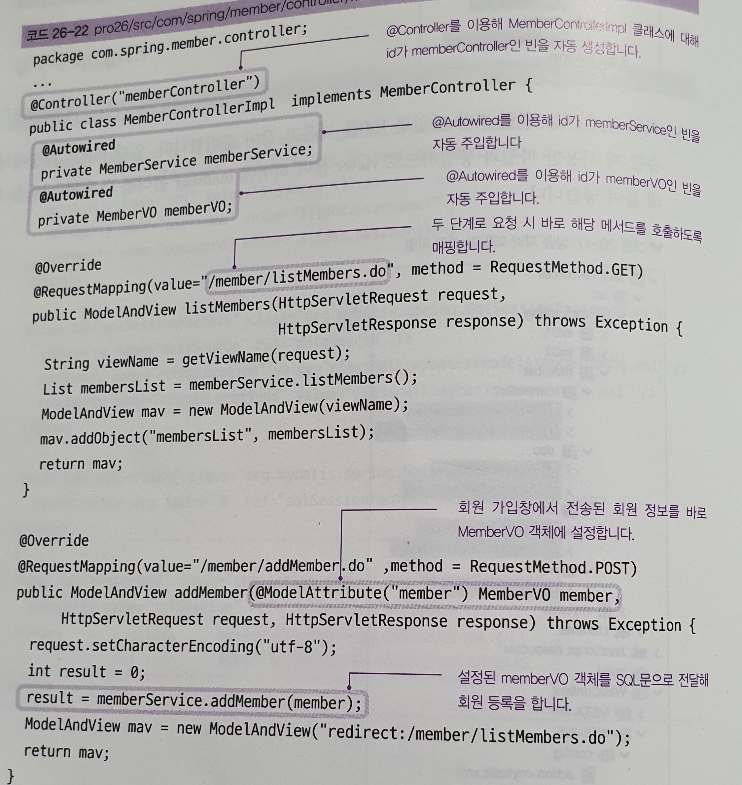
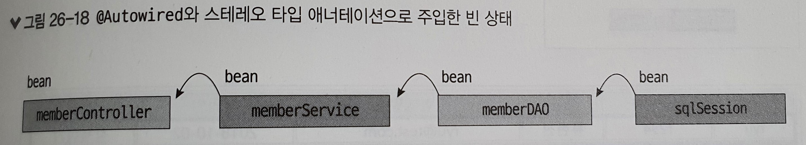

# 스프링 애너테이션2

## @Autowired 이용해 빈 주입하기

> xml에서 빈을 설정한 후 애플리케이션이 실행될 때 빈을 주입해서 사용하면 xml파일이 복잡해지면서 사용 및 관리가 불편하다는 단점이 있다 그래서 현재 스프링에서는 @Autowired를 이용해서 개발자가 만든 클래스들의 빈을 직접 자바코드에서 생성하여 사용한다.

@Autowired 특징

- 기존 xml파일에서 각각의 빈을 DI로 주입했던 기능을 코드에서 애너테이션으로 자동으로 수행
- @Autowired를 사용하면 별도의 setter나 생성자 없이 속성에 빈을 주입할 수 있다.


---

 

## 예제를 통해서 이해를 해보자


- `web.xml`

> ContextLoaderListener를 이용해 애플리케이션이 실행될 때 action-mybatis.xml을 읽어 들이도록 설정한다.

```xml
<listener>
      <listener-class>
         org.springframework.web.context.ContextLoaderListener
     </listener-class>
   </listener>
	<context-param>
      <param-name>contextConfigLocation</param-name>
      <param-value>
          /WEB-INF/config/action-mybatis.xml
      </param-value>
   </context-param>  
```


- `action-servlet.xml`

> JSP 경로를 /WEB-INF/views/member/ 로 변경

```xml
   <bean class="org.springframework.web.servlet.view.InternalResourceViewResolver">
       <property name="prefix" value="/WEB-INF/views/member/" /> 
      <property name="suffix" value=".jsp"/>
   </bean>
```


- `action-mybatis.xml`

> 스프링에서 제공하는 클래스 빈을 사용하려면 여전히 xml로 설정해줘야 하는데 memberDAO를 개발자가 만들 것이기 때문에 action-mybatis.xml에서 아래 부분은 주석 처리 해야한다. 

```xml
	<!-- <bean id="memberDAO"
		class="com.spring.member.dao.MemberDAOImpl">
		<property name="sqlSession" ref="sqlSession"></property>
	</bean> -->
```


- `controllerImpl.java`




- `serviceImpl.java`


- `memberDAO.java`


- 빈이 주입되는 과정(xml과 동일)




