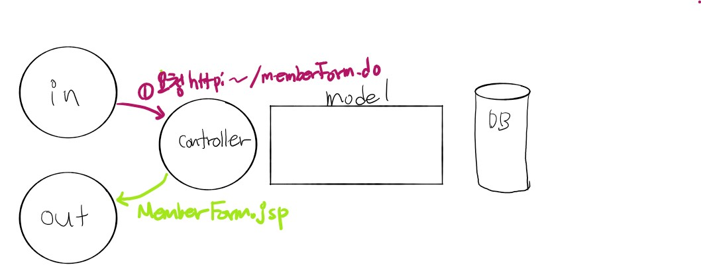
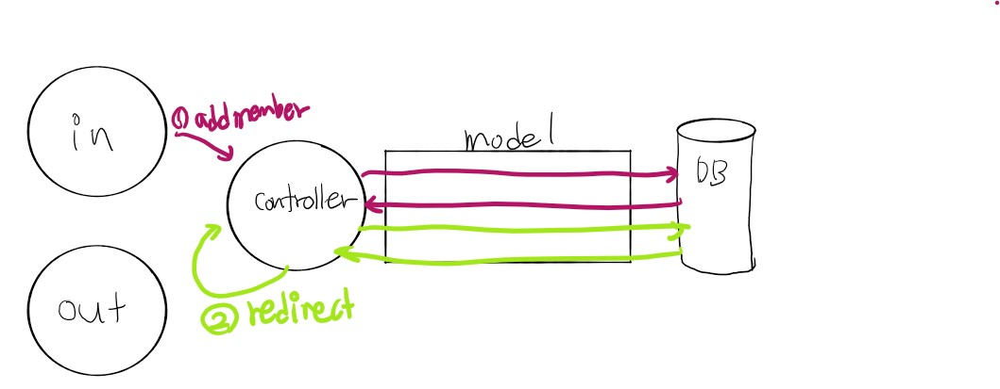

# 스프링 애너테이션2

## @Autowired 이용해 빈 주입하기

데이터베이스 작업을 클레스가 아니고 xml과 연결하여 외부로 빼는 작업


orm의 mybatis사용


---

 

## 예제를 통해서 이해를 해보자

**Backend -> frontend로 생각을 하자**

controller -> service -> dao ->member.xml -> (memberconfig.xml) -> (memberVO.java) -> action-mybatis.xml ->database->  web.xml 로 들어가고 다시 역순으로 받아서 controller -> action-servlet.xml -> *.jsp -> 


- `web.xml`

> ContextLoaderListener를 이용해 애플리케이션이 실행될 때 action-mybatis.xml을 읽도록 설정

```xml
	<!-- Creates the Spring Container shared by all Servlets and Filters -->
   <listener> <!-- 환경설정정보 어떤 상황이 되면 자동으로 실행 -->
      <listener-class>
         org.springframework.web.context.ContextLoaderListener
     </listener-class>
   </listener>
	
	<!-- MyBatis Bean 관련 설정파일 등록 -->
	<context-param>
      <param-name>contextConfigLocation</param-name>
      <param-value>
          /WEB-INF/config/action-mybatis.xml
      </param-value>
   </context-param>  

	<!-- 한글 필터 기능. 한글 깨짐 현상 방지 -->
	<filter> <!-- 한글 인코딩 문제 -->
		<filter-name>encodingFilter</filter-name>
		<filter-class>org.springframework.web.filter.CharacterEncodingFilter</filter-class>
		<init-param>
			<!-- CharacterEncodingFilter() -->
			<param-name>encoding</param-name>
			<param-value>UTF-8</param-value>
		</init-param>
	</filter>
	<filter-mapping>
		<filter-name>encodingFilter</filter-name>
		<url-pattern>/*</url-pattern> <!-- 모든 경로 설정 -->
	</filter-mapping> 
	
	<servlet>
		<servlet-name>action</servlet-name>
		<servlet-class>org.springframework.web.servlet.DispatcherServlet</servlet-class>
		<load-on-startup>1</load-on-startup>
	</servlet>

	<servlet-mapping>
		<servlet-name>action</servlet-name>
		<url-pattern>*.do</url-pattern> <!-- 모든것.do 가 들어오면 위에 있는 클래스 호출-->
	</servlet-mapping>

</web-app>


```


- `action-servlet.xml`

>Jsp 경로를 /WEB-INF/views/member/ 로 변경

```xml
<?xml version="1.0" encoding="UTF-8"?>

<beans xmlns="http://www.springframework.org/schema/beans"
xmlns:p="http://www.springframework.org/schema/p" xmlns:aop="http://www.springframework.org/schema/aop"
xmlns:context="http://www.springframework.org/schema/context"
xmlns:xsi="http://www.w3.org/2001/XMLSchema-instance"
xsi:schemaLocation="http://www.springframework.org/schema/beans   
http://www.springframework.org/schema/beans/spring-beans-3.0.xsd
http://www.springframework.org/schema/aop
http://www.springframework.org/schema/aop/spring-aop-3.0.xsd
http://www.springframework.org/schema/context
http://www.springframework.org/schema/context/spring-context-3.0.xsd">
    
<bean class="org.springframework.web.servlet.view.InternalResourceViewResolver">
      <property name="prefix" value="/WEB-INF/views/member/" /> 
      <property name="suffix" value=".jsp"/>
   </bean>

```


- `action-mybatis.xml`


action-mybatis.xml 에서는 sqlSessionFactory와 sqlSession, dataSource 객체를 xml에 기술하여 미리 생성(컨테이너에 등록)합니다. 

(1) dataSource에는 DB연결정보가 담겨있고, 

(2) sqlSessionFacory 클래스는 sqlSession을 만드는 역할을 하며, 

(3) SqlSession 클래스는 Sql문을 실제 호출해주는 역할을 한니다. SqlSessionFactory 클래스의 빈 생성만 따로 보면 dataSource객체를 생성하고, modelConfig와 mapper 위치를 지정해 주는 것을 볼 수 있습니다.

```xml
<?xml version="1.0" encoding="UTF-8"?>
<beans
 xsi:schemaLocation="http://www.springframework.org/schema/beans http://www.springframework.org/schema/beans/spring-beans.xsd http://www.springframework.org/schema/context http://www.springframework.org/schema/context/spring-context.xsd http://www.springframework.org/schema/tx http://www.springframework.org/schema/tx/spring-tx-3.0.xsd"
 xmlns:tx="http://www.springframework.org/schema/tx" xmlns:context="http://www.springframework.org/schema/context"
 xmlns:xsi="http://www.w3.org/2001/XMLSchema-instance" xmlns="http://www.springframework.org/schema/beans">

<!-- action-mybatis에서는 데이터베이스 연동 시 반환되는 값을 저장할 빈이나 트랜잭션, 데이터 소스 등 마이바티스 관련 정보를 설정합니다. -->
	<bean id="propertyPlaceholderConfigurer"
	class="org.springframework.beans.factory.config.PropertyPlaceholderConfigurer">
	<property name="locations">
	<value>/WEB-INF/config/jdbc.properties</value>
	</property>
	</bean>
	<!-- connection 관련 필요한거 미리 설정해놓는다. -->
	<!-- connection pool -->
 	<bean id="dataSource"
		class="org.apache.ibatis.datasource.pooled.PooledDataSource">
		<property name="driver" value="${jdbc.driverClassName}" />
		<property name="url" value="${jdbc.url}" />
		<property name="username" value="${jdbc.username}" />
		<property name="password" value="${jdbc.password}" />
	</bean>
	
 	<!-- connection 반환하는 작업 -->
 	<bean id="sqlSessionFactory" 
		class="org.mybatis.spring.SqlSessionFactoryBean">
		<property name="dataSource" ref="dataSource" />
		<property name="configLocation"
			value="classpath:mybatis/model/modelConfig.xml" />
		<property name="mapperLocations" value="classpath:mybatis/mappers/*.xml" /> <!-- query 날리는 부분 -->
	</bean>

	<!-- sql session query 날리는 부분 -->
	<bean id="sqlSession"
		class="org.mybatis.spring.SqlSessionTemplate">
		<constructor-arg index="0" ref="sqlSessionFactory"></constructor-arg>
	</bean>

	<!-- Member DAO는 개발자가 만든 클래스이므로 XML에서 설정하지 않고 자바코드에서 애너테이션으로 설정-->
	<!-- <bean id="memberDAO"
		class="com.spring.member.dao.MemberDAOImpl">
		<property name="sqlSession" ref="sqlSession"></property>
	</bean> -->

</beans>

```


- `jdbc.properties`

```
jdbc.driverClassName=oracle.jdbc.driver.OracleDriver
jdbc.url=jdbc:oracle:thin:@localhost:1521:xe
jdbc.username=hr
jdbc.password=1234


- `MemberControllerImpl.java`



​```java
	/*@RequestMapping(value = { "/member/loginForm.do", "/member/memberForm.do" }, method =  RequestMethod.GET)*/
	@RequestMapping(value = "/member/*Form.do", method =  RequestMethod.GET) // 1 memberForm.jsp 연결
	public ModelAndView form(HttpServletRequest request, HttpServletResponse response) throws Exception {
		String viewName = getViewName(request);
		ModelAndView mav = new ModelAndView();
		mav.setViewName(viewName);
		return mav;
}
```



```java
	@Override
	@RequestMapping(value="/member/addMember.do" ,method = RequestMethod.POST)
	public ModelAndView addMember(@ModelAttribute("member") MemberVO member,
			                  HttpServletRequest request, HttpServletResponse response) throws Exception {
		request.setCharacterEncoding("utf-8");
		int result = 0;
		result = memberService.addMember(member);
		ModelAndView mav = new ModelAndView("redirect:/member/listMembers.do");
		return mav;
	}
```


```java
	@Override
	@RequestMapping(value="/member/listMembers.do" ,method = RequestMethod.GET)
	public ModelAndView listMembers(HttpServletRequest request, HttpServletResponse response) throws Exception {
		String viewName = getViewName(request);
		List membersList = memberService.listMembers();
		ModelAndView mav = new ModelAndView(viewName);
		mav.addObject("membersList", membersList);
		return mav;
	}
```


```java
	@Override
	@RequestMapping(value="/member/removeMember.do" ,method = RequestMethod.GET)
	public ModelAndView removeMember(@RequestParam("id") String id, 
			           HttpServletRequest request, HttpServletResponse response) throws Exception{
		request.setCharacterEncoding("utf-8");
		memberService.removeMember(id);
		ModelAndView mav = new ModelAndView("redirect:/member/listMembers.do");
		return mav;
	}
```


- `MemberServiceImpl.java`

```
```


- `MemberDAOImpl.java`

> 데이터베이스 작업을 클레스가 아니고 xml과 연결하여 외부로 다 뺐다.
>
> member.xml로 빼내고 autowired로 연결한다.

```java
@Repository("memberDAO") //sql, connection, rs 등등 다없네
public class MemberDAOImpl implements MemberDAO {
	@Autowired
	private SqlSession sqlSession;
    
	@Override
	public List selectAllMemberList() throws DataAccessException {
		List<MemberVO> membersList = null;
		//아래 호출하면 member.xml과 mybatis.xml(이건 미리 다 세팅이 되어있다)이 알아서 커넥션하고 쿼리 날리고 해서 정보를 가져와 리턴해준다.
		membersList = sqlSession.selectList("mapper.member.selectAllMemberList"); 
		return membersList;
	}
```


- `member.xml`

> DAO에서 빠져나와 실질적인 Query를 날리는 부분이다. Query를 잘 모르는 개발자에게 부담을 줄이고자 함.
>
> Query를 action-mybatis.xml과 연결하여 spring에서 자동적으로 spring beans flow를 따라가게된다.

```xml
<?xml version="1.0" encoding="UTF-8" ?>
<!DOCTYPE mapper
      PUBLIC "-//mybatis.org//DTD Mapper 3.0//EN"
   "http://mybatis.org/dtd/mybatis-3-mapper.dtd">

<mapper namespace="mapper.member">
	<resultMap id="memResult" type="memberVO">
		<result property="id" column="id" />
        <result property="pwd" column="pwd" />
        <result property="name" column="name" />
        <result property="email" column="email" />
        <result property="joinDate" column="joinDate" />
	</resultMap> 

	<!-- id를 통해 사용하고 값을 resultMap에 저장한다. -->
	<select id="selectAllMemberList" resultMap="memResult">
      <![CDATA[
         select * from t_member	order by joinDate desc	 	
      ]]>
	</select>
    
    ...중략
    
    <!-- id를 통해 사용하고 값을 memberVO에 바로 접근하여 저장한다. -->
    <select id="selectMemberById" resultType="memberVO"  parameterType="String" >
      <![CDATA[
         select * from t_member
         where
         id=#{id}			
      ]]><!-- id가 정해지지 않고 #으로 설정하여 외부에서 들여온다. -->
	 </select>	
    
    
```


- `modelConfig.xml`

> memberVO로 바로 접근가능하게 경로 설정 해줌?! 확인필요

```XML
<!-- 이렇게 줄여서 사용하겠다 -->
<typeAlias type="com.spring.member.vo.MemberVO"  alias="memberVO" /> 
```


- `MemberVO.java`

```java
@Component("memberVO")
public class MemberVO {
	private String id;
	private String pwd;
	private String name;
	private String email;
	private Date joinDate;
	
	..생략
```


