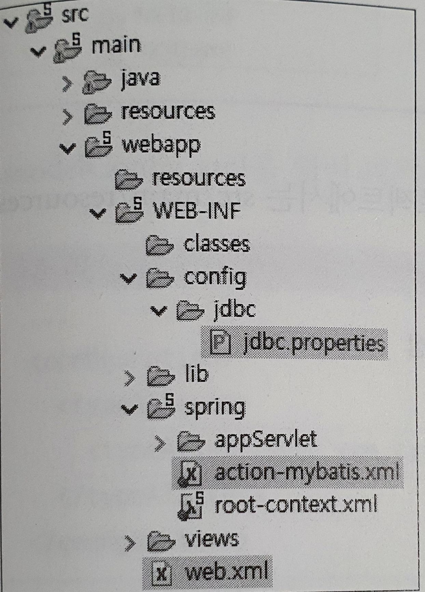
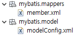

# 메이븐과 스프링 STS 사용법

### 중요!

spring legacy project(spring MVC project) 생성시 컨텍스트 이름이 프로젝트 이름이 아니고 Top level package의 이름이 된다.


예를들어 다음과 같은 프로젝트에서 web browser 호출시

`http://localhost:9090/testspring/` 라고 호출해야 한다.


그리고 servers폴더의 server.xml에 들어가게 되면 path가 나온다 다른 이름을 원한다면 이것을 수정하면 된다.

```xml
<Context docBase="springtest" path="/testspring" reloadable="true" source="org.eclipse.jst.jee.server:springtest"/>
```


### 프로젝트 만들기!! 순서도 중요!

- 프로젝트 만드는 순서(책순서) : 프로젝트생성 -> Mybatis 관련 xml 파일 추가 -> 자바클래스와 JSP구현

- 동작순서는 당연히 다르다.

만들면 다음과 같이 기본적으로 생성이 된다.


- `web.xml`

> ContextLoaderListener를 이용해 애플리케이션이 실행될 때 action-mybatis.xml을 읽도록 설정

```xml
	<!-- Creates the Spring Container shared by all Servlets and Filters -->
   <listener> <!-- 환경설정정보 어떤 상황이 되면 자동으로 실행 -->
      <listener-class>
         org.springframework.web.context.ContextLoaderListener
     </listener-class>
   </listener>
	
	<!-- MyBatis Bean 관련 설정파일 등록 -->
	<context-param>
      <param-name>contextConfigLocation</param-name>
      <param-value>
          /WEB-INF/config/action-mybatis.xml
      </param-value>
   </context-param>  

	<!-- 한글 필터 기능. 한글 깨짐 현상 방지 -->
	<filter> <!-- 한글 인코딩 문제 -->
		<filter-name>encodingFilter</filter-name>
		<filter-class>org.springframework.web.filter.CharacterEncodingFilter</filter-class>
		<init-param>
			<!-- CharacterEncodingFilter() -->
			<param-name>encoding</param-name>
			<param-value>UTF-8</param-value>
		</init-param>
	</filter>
	<filter-mapping>
		<filter-name>encodingFilter</filter-name>
		<url-pattern>/*</url-pattern> <!-- 모든 경로 설정 -->
	</filter-mapping> 
	
	<servlet>
		<servlet-name>action</servlet-name>
		<servlet-class>org.springframework.web.servlet.DispatcherServlet</servlet-class>
		<load-on-startup>1</load-on-startup>
	</servlet>

	<servlet-mapping>
		<servlet-name>action</servlet-name>
		<url-pattern>*.do</url-pattern> <!-- 모든것.do 가 들어오면 위에 있는 클래스 호출-->
	</servlet-mapping>

</web-app>


```


- `servlet-context.xml`

>~.do 경로를 /WEB-INF/views/member/~.Jsp 로 변경

```xml
<?xml version="1.0" encoding="UTF-8"?>

<beans xmlns="http://www.springframework.org/schema/beans"
xmlns:p="http://www.springframework.org/schema/p" xmlns:aop="http://www.springframework.org/schema/aop"
xmlns:context="http://www.springframework.org/schema/context"
xmlns:xsi="http://www.w3.org/2001/XMLSchema-instance"
xsi:schemaLocation="http://www.springframework.org/schema/beans   
http://www.springframework.org/schema/beans/spring-beans-3.0.xsd
http://www.springframework.org/schema/aop
http://www.springframework.org/schema/aop/spring-aop-3.0.xsd
http://www.springframework.org/schema/context
http://www.springframework.org/schema/context/spring-context-3.0.xsd">
    
<bean class="org.springframework.web.servlet.view.InternalResourceViewResolver">
      <property name="prefix" value="/WEB-INF/views/member/" /> 
      <property name="suffix" value=".jsp"/>
   </bean>

```


### 자바클래스와 JSP구현


- `MemberControllerImpl.java`


```java
	/*@RequestMapping(value = { "/member/loginForm.do", "/member/memberForm.do" }, method =  RequestMethod.GET)*/
	@RequestMapping(value = "/member/*Form.do", method =  RequestMethod.GET) // 1 memberForm.jsp 연결
	public ModelAndView form(HttpServletRequest request, HttpServletResponse response) throws Exception {
		String viewName = getViewName(request);
		ModelAndView mav = new ModelAndView();
		mav.setViewName(viewName);
		return mav;
}
```


```java
	@Override
	@RequestMapping(value="/member/addMember.do" ,method = RequestMethod.POST)
	public ModelAndView addMember(@ModelAttribute("member") MemberVO member,
			                  HttpServletRequest request, HttpServletResponse response) throws Exception {
		request.setCharacterEncoding("utf-8");
		int result = 0;
		result = memberService.addMember(member);
		ModelAndView mav = new ModelAndView("redirect:/member/listMembers.do");
		return mav;
	}
```


```java
	@Override
	@RequestMapping(value="/member/listMembers.do" ,method = RequestMethod.GET)
	public ModelAndView listMembers(HttpServletRequest request, HttpServletResponse response) throws Exception {
		String viewName = getViewName(request);
		List membersList = memberService.listMembers();
		ModelAndView mav = new ModelAndView(viewName);
		mav.addObject("membersList", membersList);
		return mav;
	}
```


```java
	@Override
	@RequestMapping(value="/member/removeMember.do" ,method = RequestMethod.GET)
	public ModelAndView removeMember(@RequestParam("id") String id, 
			           HttpServletRequest request, HttpServletResponse response) throws Exception{
		request.setCharacterEncoding("utf-8");
		memberService.removeMember(id);
		ModelAndView mav = new ModelAndView("redirect:/member/listMembers.do");
		return mav;
	}
```


- `MemberServiceImpl.java`

```

```


- `MemberDAOImpl.java`

> 데이터베이스 작업을 클레스가 아니고 xml과 연결하여 외부로 다 뺐다.
>
> member.xml로 빼내고 autowired로 연결한다.

```java
@Repository("memberDAO") //sql, connection, rs 등등 다없네
public class MemberDAOImpl implements MemberDAO {
	@Autowired
	private SqlSession sqlSession;
    
	@Override
	public List selectAllMemberList() throws DataAccessException {
		List<MemberVO> membersList = null;
		//아래 호출하면 member.xml과 mybatis.xml(이건 미리 다 세팅이 되어있다)이 알아서 커넥션하고 쿼리 날리고 해서 정보를 가져와 리턴해준다. 호출하면 web.xml 의listener -> action-mybatis.xml의sqlssion -> sqlfactory 자세한건 밑에 코드 
		membersList = sqlSession.selectList("mapper.member.selectAllMemberList"); 
		return membersList;
	}
```


### Mybatis 관련 xml 파일 추가




- `action-mybatis.xml`

>데이터베이스 연동 시 반환되는 값을 저장할 빈이나 트랜잭션, 데이터 소스 등 마이바티스 관련 정보를 설정한다.


action-mybatis.xml 에서는 sqlSessionFactory와 sqlSession, dataSource 객체를 xml에 기술하여 미리 생성(컨테이너에 등록)합니다. 

(1) dataSource에는 DB연결정보가 담겨있고, 

(2) sqlSessionFacory 클래스는 sqlSession을 만드는 역할을 하며, 

(3) SqlSession 클래스는 Sql문을 실제 호출해주는 역할을 한니다. SqlSessionFactory 클래스의 빈 생성만 따로 보면 dataSource객체를 생성하고, modelConfig와 mapper 위치를 지정해 주는 것을 볼 수 있습니다.

```xml
<?xml version="1.0" encoding="UTF-8"?>
<beans
 xsi:schemaLocation="http://www.springframework.org/schema/beans http://www.springframework.org/schema/beans/spring-beans.xsd http://www.springframework.org/schema/context http://www.springframework.org/schema/context/spring-context.xsd http://www.springframework.org/schema/tx http://www.springframework.org/schema/tx/spring-tx-3.0.xsd"
 xmlns:tx="http://www.springframework.org/schema/tx" xmlns:context="http://www.springframework.org/schema/context"
 xmlns:xsi="http://www.w3.org/2001/XMLSchema-instance" xmlns="http://www.springframework.org/schema/beans">


	<bean id="propertyPlaceholderConfigurer"
	class="org.springframework.beans.factory.config.PropertyPlaceholderConfigurer">
	<property name="locations">
	<value>/WEB-INF/config/jdbc.properties</value>
	</property>
	</bean>
	<!-- connection 관련 필요한거 미리 설정해놓는다. -->
	<!-- connection pool -->
 	<bean id="dataSource"
		class="org.apache.ibatis.datasource.pooled.PooledDataSource">
		<property name="driver" value="${jdbc.driverClassName}" />
		<property name="url" value="${jdbc.url}" />
		<property name="username" value="${jdbc.username}" />
		<property name="password" value="${jdbc.password}" />
	</bean>
	
 	<!-- connection 반환하는 작업 -->
    <!-- datasource를 이용해 접속하고 resources의 myabatis와 연결 -->
 	<bean id="sqlSessionFactory" 
		class="org.mybatis.spring.SqlSessionFactoryBean">
		<property name="dataSource" ref="dataSource" />
		<property name="configLocation"
			value="classpath:mybatis/model/modelConfig.xml" />
		<property name="mapperLocations" value="classpath:mybatis/mappers/*.xml" /> 
	</bean>

	<!-- sql session query 날리는 부분 sqlSessionFactory 참조-->
	<bean id="sqlSession"
		class="org.mybatis.spring.SqlSessionTemplate">
		<constructor-arg index="0" ref="sqlSessionFactory"></constructor-arg>
	</bean>

	<!-- Member DAO는 개발자가 만든 클래스이므로 XML에서 설정하지 않고 자바코드에서 애너테이션으로 설정-->
	<!-- <bean id="memberDAO"
		class="com.spring.member.dao.MemberDAOImpl">
		<property name="sqlSession" ref="sqlSession"></property>
	</bean> -->

</beans>

```


- `jdbc.properties`

> 이 정보로 connection pool과 연결(?)되어 접근한다.

```java
jdbc.driverClassName=oracle.jdbc.driver.OracleDriver
jdbc.url=jdbc:oracle:thin:@localhost:1521:xe
jdbc.username=hr
jdbc.password=1234
```




​																					mybatis 패키지

위의 패키지를 생성하여 모델과 sql을 기술할 **member.xml(class.xml)**과 모델들을 한꺼번에 쉽게(alias) 관리할 **modelConfig.xml** 파일을 생성합니다.

- `member.xml`

> DAO에서 빠져나와 실질적인 Query를 날리는 부분이다. Query를 잘 모르는 개발자에게 부담을 줄이고자 함.
>
> Query를 web.xml과 연결 그리고 거기서 action-mybatis.xml과 연결하여 spring에서 자동적으로 spring beans flow를 따라가게된다.

```xml
<?xml version="1.0" encoding="UTF-8" ?>
<!DOCTYPE mapper
      PUBLIC "-//mybatis.org//DTD Mapper 3.0//EN"
   "http://mybatis.org/dtd/mybatis-3-mapper.dtd">
<!--property는 memberVO클래스의 각 변수에 들어가고 column은 table 값이다 즉, 각각을 연결시켜준다.-->
<mapper namespace="mapper.member">
	<resultMap id="memResult" type="memberVO">
		<result property="id" column="id" />
        <result property="pwd" column="pwd" />
        <result property="name" column="name" />
        <result property="email" column="email" />
        <result property="joinDate" column="joinDate" />
	</resultMap> 

	<!-- id를 통해 사용하고 값을 resultMap에 저장한다. -->
	<select id="selectAllMemberList" resultMap="memResult">
      <![CDATA[
         select * from t_member	order by joinDate desc	 	
      ]]>
	</select>
    
    ...중략
    
    <!-- id를 통해 사용하고 값을 memberVO에 바로 접근하여 저장한다. -->
    <select id="selectMemberById" resultType="memberVO"  parameterType="String" >
      <![CDATA[
         select * from t_member
         where
         id=#{id}			
      ]]><!-- id가 정해지지 않고 #으로 설정하여 외부에서 들여온다. -->
	 </select>	
    
    
```


- `modelConfig.xml`

> memberVO로 바로 접근가능하게 경로 설정 해줌
>
> 아래의 파일은 **modelConfig.xml 파일**입니다. modelConfig 파일에서는 <typeAliases> 태그를 이용하여 긴 클래스명을 간략하게 사용할 수 있도록 합니다. 또한 모델을 등록함으로써 모델들을 관리하는 역할도 할 수 있습니다.

```XML
<!-- 이렇게 줄여서 사용하겠다 -->
<typeAlias type="com.spring.member.vo.MemberVO"  alias="memberVO" /> 
```


- `MemberVO.java`

```java
@Component("memberVO")
public class MemberVO {
	private String id;
	private String pwd;
	private String name;
	private String email;
	private Date joinDate;
	
	..생략
```


---


### Context 부연설명

web.xml에 있네

**contextConfigLocation 자세히 알기**

> **Spring에 대해 정리해보자면 스프링은 WAR 독립 웹 모듈(애플리케이션)으로 주로 개발된다. 서블릿 컨테이너에 올라가는 웹 애플리케이션이다.**

> **독립 웹 모듈로 만들어진 하나의 스프링 애플리케이션에 애플리케이션 컨텍스트는 몇 개가, 어떻게 만들어질까? 스프링을 제대로 공부했다면 두개가 만들어지는 것을 알 수 있댜.**

> **하나는 ContextLoaderListener에 의해 만들어지는 Root WebApplicationContext이고, 다른 하나는 DispatcherServlet에 의해서 만들어지는 WebApplicationContext이다. 전자는 보통 서비스 계층과 DAO를 포함한 (웹 환경에 독립적인) 빈 들을 담아두고, 후자는 DispatcherServlet이 직접 사용하는 컨트롤러를 포함한 웹 관련 빈들을 빈을 등록하는 데 사용한다. 그리고 이둘은 Parent-Child Application Context 관계로 맺어진다. 따라서 ContextLoaderListener로 만들어지는 컨텍스트를 Root WAC라고 부르는 것이다.**

> 그런데 Root WAC는 사실 없어도 된다. 당연히 스프링 앱에는 Root WAS를 등록하는 ContextLoaderListener가 필요한 것 같지만 실제론 강제되지 않는다. 대신 서블릿 레벨의 WAC에 웹용 빈들은 물론이고 서비스, DAO 계층의 빈들도 모두 넣으면 된다. 실제로 여러 개의 DispatcherServlet이 만들어질 것이 아니라면 Root WAC를 따로 등록하나 아니나 그게 그거다.

> DispatcherServlet 단위의 WAC는 보통 서블릿이름-servlet.xml이라는 이름규칙을 가지고 설정파일을 찾는다. 하지만 이는 얼마든지 바꿀 수 있다. 서블릿 이름과 상관없이 직접 지정한 여러 개의 설정파일을 읽도록 만들어도 그만이다.

> [출저] [InsideSpring (3) 스프링 밖에서 WebApplicationContext에 접근하기](http://toby.epril.com/?p=934)

References : https://dadmi97.tistory.com/79


생각해보기...

**Backend -> frontend로 생각을 하자**

web에서 ~~.do 로 요청 ->controller ?! -> service -> dao ->member.xml -> (memberconfig.xml) -> (memberVO.java) -> action-mybatis.xml ->database->  web.xml 로 들어가고 다시 역순으로 받아서 controller -> action-servlet.xml -> *.jsp -> 

