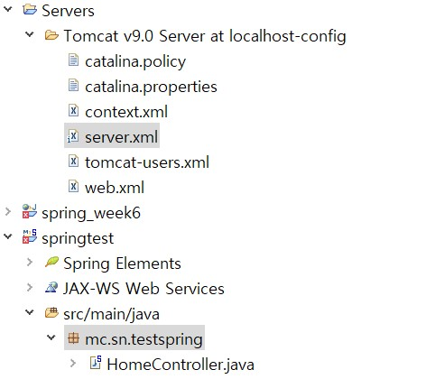
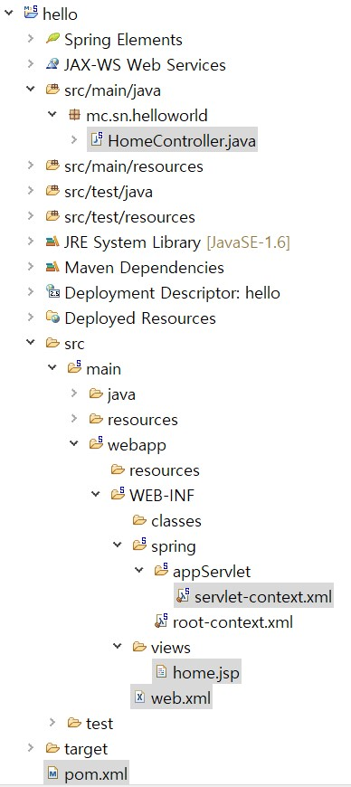
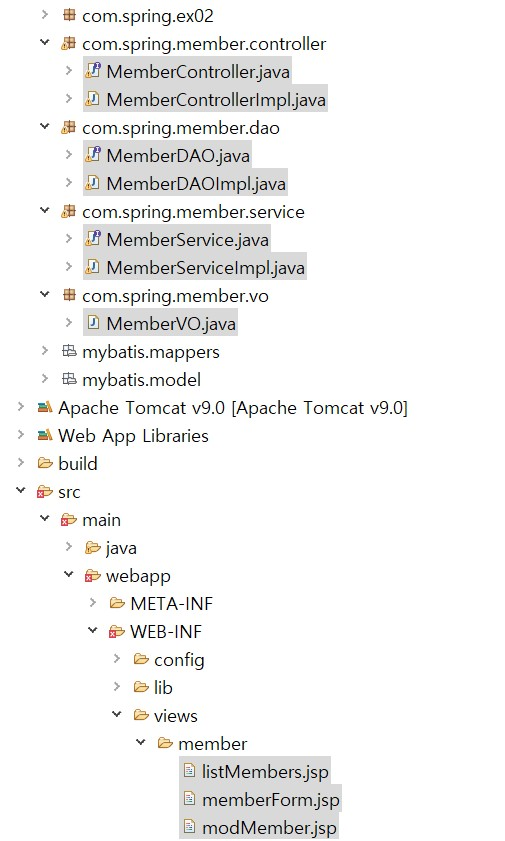
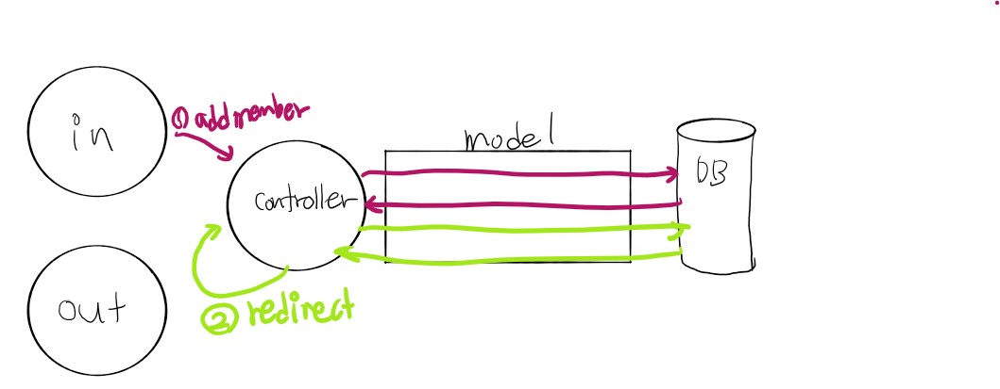
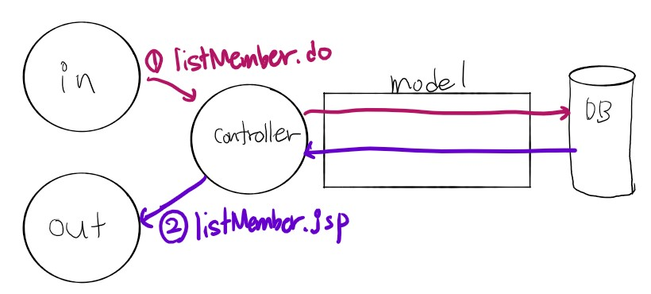
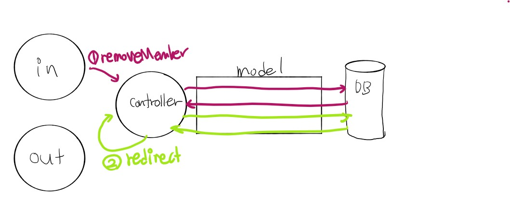

# 메이븐과 스프링 STS 사용법

### 중요!

spring legacy project(spring MVC project) 생성시 컨텍스트 이름이 프로젝트 이름이 아니고 Top level package의 이름이 된다.



예를들어 다음과 같은 프로젝트에서 web browser 호출시

`http://localhost:9090/testspring/` 라고 호출해야 한다.


그리고 servers폴더의 server.xml에 들어가게 되면 path가 나온다 다른 이름을 원한다면 이것을 수정하면 된다.

```xml
<Context docBase="springtest" path="/testspring" reloadable="true" source="org.eclipse.jst.jee.server:springtest"/>
```


## 프로젝트 만들기!! 순서도 중요!

### 1. 기본 스프링MVC생성

만들면 다음과 같이 기본적으로 생성이 된다.



- `web.xml`

> ContextLoaderListener를 이용해 애플리케이션이 실행될 때 action-mybatis.xml을 읽도록 설정

```xml
	<!-- Creates the Spring Container shared by all Servlets and Filters -->
   <listener> <!-- 환경설정정보 어떤 상황이 되면 자동으로 실행 -->
      <listener-class>
         org.springframework.web.context.ContextLoaderListener
     </listener-class>
   </listener>
	
	<!-- MyBatis Bean 관련 설정파일 등록 -->
	<context-param>
      <param-name>contextConfigLocation</param-name>
      <param-value>
          /WEB-INF/config/action-mybatis.xml
      </param-value>
   </context-param>  

	<!-- 한글 필터 기능. 한글 깨짐 현상 방지 -->
	<filter> <!-- 한글 인코딩 문제 -->
		<filter-name>encodingFilter</filter-name>
		<filter-class>org.springframework.web.filter.CharacterEncodingFilter</filter-class>
		<init-param>
			<!-- CharacterEncodingFilter() -->
			<param-name>encoding</param-name>
			<param-value>UTF-8</param-value>
		</init-param>
	</filter>
	<filter-mapping>
		<filter-name>encodingFilter</filter-name>
		<url-pattern>/*</url-pattern> <!-- 모든 경로 설정 -->
	</filter-mapping> 
	
	<servlet>
		<servlet-name>action</servlet-name>
		<servlet-class>org.springframework.web.servlet.DispatcherServlet</servlet-class>
		<load-on-startup>1</load-on-startup>
	</servlet>

	<servlet-mapping>
		<servlet-name>action</servlet-name>
		<url-pattern>*.do</url-pattern> <!-- 모든것.do 가 들어오면 위에 있는 클래스 호출-->
	</servlet-mapping>

</web-app>


```


- `servlet-context.xml`

>~.do 경로를 /WEB-INF/views/member/~.Jsp 로 변경

```xml
<?xml version="1.0" encoding="UTF-8"?>

<beans xmlns="http://www.springframework.org/schema/beans"
xmlns:p="http://www.springframework.org/schema/p" xmlns:aop="http://www.springframework.org/schema/aop"
xmlns:context="http://www.springframework.org/schema/context"
xmlns:xsi="http://www.w3.org/2001/XMLSchema-instance"
xsi:schemaLocation="http://www.springframework.org/schema/beans   
http://www.springframework.org/schema/beans/spring-beans-3.0.xsd
http://www.springframework.org/schema/aop
http://www.springframework.org/schema/aop/spring-aop-3.0.xsd
http://www.springframework.org/schema/context
http://www.springframework.org/schema/context/spring-context-3.0.xsd">
    
<bean class="org.springframework.web.servlet.view.InternalResourceViewResolver">
      <property name="prefix" value="/WEB-INF/views/member/" /> 
      <property name="suffix" value=".jsp"/>
   </bean>

```


### 1-2. Controller



#### 1. `MemberControllerImpl.java`

> service/dao/vo를 사용할 경우 이렇게 연결해 줘야하고 서비스 부분을 사용할 시 역순으로 호출하기때문에코딩시 vo/dao/serivce/controller 순으로 작성하자. 

```java
@Autowired
private MemberService memberService;-> @Service("memberService") //memberService.java
@Autowired
private MemberVO memberVO ; -> @Component("memberVO") //memberVO.java 각각 이렇게 연결
```

1. `*Form.do`


```java
	@RequestMapping(value = "/member/memberForm.do", method =  RequestMethod.GET) // 1 memberForm.jsp 연결
	public ModelAndView form(HttpServletRequest request, HttpServletResponse response) throws Exception {
		String viewName = getViewName(request); //request에 memberForm.do가 드감
		ModelAndView mav = new ModelAndView(); //ModerAndView 인스턴스 생성
		mav.setViewName(viewName); //뷰의 이름 설정 ModerAndView에 뷰의 경로를 담는다.
		return mav; //ModerAndView 객체를 리턴
}
```

ModelAndView : 경로와 데이터를 다 저장한다.


뷰의 이름(경로)를 설정해주려면

setViewName() 메소드를 이용한다.

```
mav.setViewName("뷰의 경로");
```

 

데이터를 보낼때는

addObject() 메소드를 이용한다.

```
mav.addObject("변수 이름", "데이터 값");
```


2. `addMember.do`



```java
	@Override
	@RequestMapping(value="/member/addMember.do" ,method = RequestMethod.POST)
	public ModelAndView addMember(@ModelAttribute("member") MemberVO member,
			                  HttpServletRequest request, HttpServletResponse response) throws Exception {
		request.setCharacterEncoding("utf-8");
		int result = 0;
		result = memberService.addMember(member); 
		ModelAndView mav = new ModelAndView("redirect:/member/listMembers.do");
		return mav;
	}
```


3. `listMember.do`



```java
	@Override
	@RequestMapping(value="/member/listMembers.do" ,method = RequestMethod.GET)
	public ModelAndView listMembers(HttpServletRequest request, HttpServletResponse response) throws Exception {
		String viewName = getViewName(request);
		List membersList = memberService.listMembers();
		ModelAndView mav = new ModelAndView(viewName);
		mav.addObject("membersList", membersList);
		return mav;
	}
```


4. `removeMember.do`



```java
	@Override
	@RequestMapping(value="/member/removeMember.do" ,method = RequestMethod.GET)
	public ModelAndView removeMember(@RequestParam("id") String id, 
			           HttpServletRequest request, HttpServletResponse response) throws Exception{
		request.setCharacterEncoding("utf-8");
		memberService.removeMember(id);
		ModelAndView mav = new ModelAndView("redirect:/member/listMembers.do");
		return mav;
	}
```


5. `searchMember.do`


```java
@Override
	@RequestMapping(value="/member/searchMember.do" ,method = RequestMethod.GET)
	public ModelAndView searchMember(@RequestParam("id") String id, 
			           HttpServletRequest request, HttpServletResponse response) throws Exception{
		request.setCharacterEncoding("utf-8");
		MemberVO vo = memberService.searchMember(id);
		ModelAndView mav = new ModelAndView("forward:/member/updateForm.do");
		mav.addObject("member",vo);
		return mav;
	}
```


6. `updateMember.do`

```java
@Override
	@RequestMapping(value="/member/updateMember.do" ,method = RequestMethod.GET)
	public ModelAndView updateMember(@ModelAttribute("member") MemberVO member,
			                  HttpServletRequest request, HttpServletResponse response) throws Exception {
		request.setCharacterEncoding("utf-8");
		int result = 0;
		result = memberService.updateMember(member);
		ModelAndView mav = new ModelAndView("redirect:/member/listMembers.do");
		return mav;
	}
```


##### 포워드(forward) VS 리다이렉트(redirect)

포워드


\- Client가 Server에 HTTP Resource를 Request

\- Server는 Servlet Container(ex Tomcat)에 의해 다른 Servlet으로 forward

\- Server가 다른 Servlet의 HTTP Resource를 Response


 

\- Client가 Server에 HTTP Resource를 Request

\- Server는 상태값 303과 함께 새로운 Location을 Response

\- Client가 Server에게 새로운 HTTP Resource를 Request

\- Server가 새로운 Resource로 Response

출처 : https://has3ong.tistory.com/104


### 1-3 IN-OUT 확인

1. `memberForm.jsp`

> controller의 return값 mav에 있는 *Form.do을 통해 호출된다
>
> controller와 post/get 매칭해줘야하고 .jsp를 보여준 뒤 submit을 하면 action form속성을 이용해 addMember.do랑 연결된다.

```jsp
<form method="post"   action="${contextPath}/member/addMember.do">
```


2. `listMember.jsp`

```jsp
<body>
<table border="1"  align="center"  width="80%">
    <tr align="center"   bgcolor="lightgreen">
      <td ><b>아이디</b></td>
      <td><b>비밀번호</b></td>
      <td><b>이름</b></td>
      <td><b>이메일</b></td>
      <td><b>가입일</b></td>
      <td><b>삭제</b></td>
   </tr>
   
 <c:forEach var="member" items="${membersList}" >     
   <tr align="center">
      <td>
      	<a href="${contextPath}/member/searchMember.do?id=${member.id }">${member.id}</a>
      </td>
      <td>${member.pwd}</td>
      <td>${member.name}</td>
      <td>${member.email}</td>
      <td>${member.joinDate}</td>
      <td><a href="${contextPath}/member/removeMember.do?id=${member.id }">삭제하기</a></td>
    </tr>
  </c:forEach>   
</table>
<a  href="${contextPath}/member/memberForm.do"><h1 style="text-align:center">회원가입</h1></a>
</body>
```


3. `update.jsp`

> value= "${member.id}"를 통해 자신이 수정하고자 하는 값을 보여준다. 이 값을 수정하고 updateMember.do로 보내게 된다.

```jsp
<body>
	<form method="get"   action="${contextPath}/member/updateMember.do">
	<h1  class="text_center">회원 가입창</h1>
	<table  align="center">
	   <tr>
	      <td width="200"><p align="right">아이디</td>
	      <td width="400"><input type="text" name="id" value="${member.id}"></td>
	   </tr>
	   <tr>
	      <td width="200"><p align="right">비밀번호</td>
	      <td width="400"><input type="password" name="pwd" value="${member.pwd}"></td>
	    </tr>
	    <tr>
	       <td width="200"><p align="right">이름</td>
	       <td width="400"><p><input type="text" name="name" value="${member.name}"></td>
	    </tr>
	    <tr>
	       <td width="200"><p align="right">이메일</td>
	       <td width="400"><p><input type="text" name="email" value="${member.email}"></td>
	    </tr>
	    <tr>
	       <td width="200"><p>&nbsp;</p></td>
	       <td width="400"><input type="submit" value="수정하기"><input type="reset" value="다시입력"></td>
	    </tr>
	</table>
	</form>
</body>
```


---


### Context 부연설명

web.xml에 있네

**contextConfigLocation 자세히 알기**

> **Spring에 대해 정리해보자면 스프링은 WAR 독립 웹 모듈(애플리케이션)으로 주로 개발된다. 서블릿 컨테이너에 올라가는 웹 애플리케이션이다.**

> **독립 웹 모듈로 만들어진 하나의 스프링 애플리케이션에 애플리케이션 컨텍스트는 몇 개가, 어떻게 만들어질까? 스프링을 제대로 공부했다면 두개가 만들어지는 것을 알 수 있댜.**

> **하나는 ContextLoaderListener에 의해 만들어지는 Root WebApplicationContext이고, 다른 하나는 DispatcherServlet에 의해서 만들어지는 WebApplicationContext이다. 전자는 보통 서비스 계층과 DAO를 포함한 (웹 환경에 독립적인) 빈 들을 담아두고, 후자는 DispatcherServlet이 직접 사용하는 컨트롤러를 포함한 웹 관련 빈들을 빈을 등록하는 데 사용한다. 그리고 이둘은 Parent-Child Application Context 관계로 맺어진다. 따라서 ContextLoaderListener로 만들어지는 컨텍스트를 Root WAC라고 부르는 것이다.**

> 그런데 Root WAC는 사실 없어도 된다. 당연히 스프링 앱에는 Root WAS를 등록하는 ContextLoaderListener가 필요한 것 같지만 실제론 강제되지 않는다. 대신 서블릿 레벨의 WAC에 웹용 빈들은 물론이고 서비스, DAO 계층의 빈들도 모두 넣으면 된다. 실제로 여러 개의 DispatcherServlet이 만들어질 것이 아니라면 Root WAC를 따로 등록하나 아니나 그게 그거다.

> DispatcherServlet 단위의 WAC는 보통 서블릿이름-servlet.xml이라는 이름규칙을 가지고 설정파일을 찾는다. 하지만 이는 얼마든지 바꿀 수 있다. 서블릿 이름과 상관없이 직접 지정한 여러 개의 설정파일을 읽도록 만들어도 그만이다.

> [출저] [InsideSpring (3) 스프링 밖에서 WebApplicationContext에 접근하기](http://toby.epril.com/?p=934)

References : https://dadmi97.tistory.com/79


