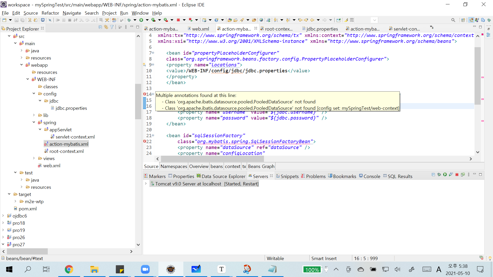

# 메이븐 주의 사항

### 복붙시 이름에 대해서 고쳐야 할 사항!

예) mc.sn.~~에서 mc.sn.review로 변경시

- `modelConfig.xml`

`<typeAlias type="mc.sn.review.member.vo.MemberVO"  alias="memberVO" />`

- `servlet-context.xml`

```xml
<context:component-scan base-package="mc.sn.review" />
```

- input.jsp

```jsp
<form action="/review/login/result.do" method="post">
```


### 오류

**http: 404 페이지를 찾을 수 없습니다.** 여러가지가 존재

`servlet-context.xml`의 경로와 home.jsp의 위치를 확인!

또 controller도 확인해야한다! 컨트롤러가 있어야 view와 연결이 된다. 항상 조심하자..ㅠㅠ

```java
//나머지 폼 형식도 모두 컨트롤러가 존재해야 view와 연결된다!!
	@RequestMapping(value = "/member/*Form.do", method =  RequestMethod.GET)
	public ModelAndView form(HttpServletRequest request, HttpServletResponse response) throws Exception {
		String viewName = getViewName(request);
		ModelAndView mav = new ModelAndView();
		mav.setViewName(viewName);
		return mav;
	}
```


---


`updateForm.jsp` 오류

데이터 업데이트시 프라이머리 값도 보내는 데이터에 실어서 보내야한다. 따라서 hidden으로 보내라~

```jsp
<input type=hidden name="tid" value="${member.tid}"> <!-- primary값 hidden으로 보내야 한다! --> 
```


---


`loginForm.jsp` 테이블에 있는 값이 Id : hong/ pwd : 1212 한 다음에 다시 잘못된 걸로 로그인 하면 여전히 로그인이 되는데 


- `memberControllerImpl.java`

> 아래와 같이 session을 사용하면 30분간 데이터가 유지되기 때문이다. 

```java
if(memberVO != null) {
	    HttpSession session = request.getSession();
	    session.setAttribute("member", memberVO);
```


- result.jsp

> 그래서 이렇게 `session.invalidate` 를 사용하여 세션 로그아웃 기능을 수행해야 한다.

```jsp
<%
	session.invalidate(); //log out 기능
%>
```


---


- `pom.xml`에 action-mybatis dependency태그 설정 안할시




- `web.xml`에 action-mybatis 설정 누락시


