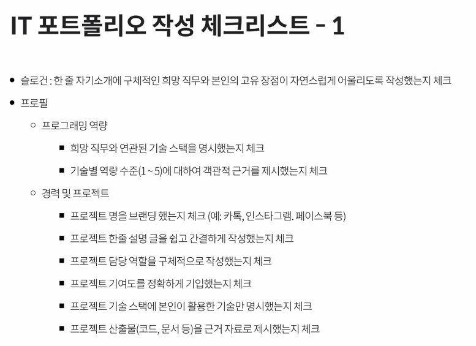
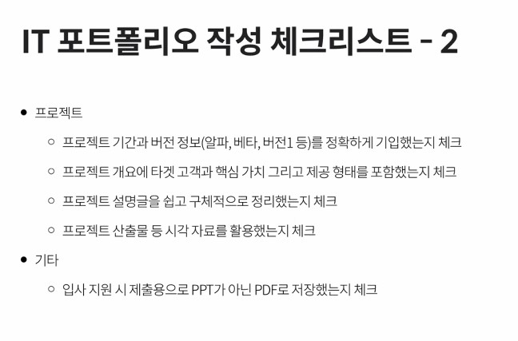

# Design Thinking

### 1. Design Thinking 이란?

> 타인이 불편한 점이 무엇인지 파악하라

- 적합성 : 타겟 대상자에 적합한지
- 실현가능성 : 우리가 구현 가능한가?
- 지속성 : 돈이 되는지! 계속 해서 타겟 대상자가 사용할지?

### 2. Design Thinking 과정

1. 공감하기

   아프리카 신생하들이 왜 이렇게 많이 죽을까?

2. 문제정의

   인큐베이터가 부족하여 저체온증 때문에

3. 아이디어 내기

   어떻게 해야 죽음을 줄일 수 있을까?

4. 프로토타입 만들기

   

5. 테스트하기

---

## 프로젝트 기획서 작성법

1. 프로젝트명
   - 컨셉
2. 목차
   - 고객 문제 정의
   - 원인 분석
   - 솔루션 제시
   - 제품 및 서비스
   - 주요 기능
   - 핵심 기술
   - 프로젝트 팀
   - 추진 일정
   - 기대 효과
3. 문제점에 대한 현황 제시(도표, 그래프 이용)
   - 특정 대상이 겪는 문제들 중에서 해결할 만한 가치가 있는 진짜 문제를 정의함.
   - 목표 고객 규모와 문제의 심각성을 수치로 표현가능하고 구체적이여야 함
   - 본 페이지에서 타인으로부터 문제에 대한 공감을 얻을 수 있어야 함
4. 그 문제점의 원인
   - 목표 고객이 격은 진짜 문제의 근본적인 원인을 심도있게 분석하여 서술
   - 밝혀진 원인 중에서 프로젝트 팀이 현실적으로 해결가능한 원인을 선택(모든 원인 선택 x)
5. 솔루션 
   - 진짜 문제의 핵심 원인을 해소할수 있는 해결책 제시
   - 적은 비용으로 빠르게 구현 가능해야 한다.
   - 독창성, 효과성, 효율성을 통해 경쟁력이 예상되어야 함.
6. 제품 및 서비스 프로토타입
   - 누구나 쉽게 이해할 수 있도록 이미지와 같은 시각화 자료를 최대한 활용
7. 3대 핵심 기능
8. 팀원소개 및 맡은바 간략하게 설명
9. 추진 일정
10. 기대효과.

---

## 포트폴리오

### IT 포트폴리오의 스택

1. 슬로건

   - sw 개발자로서 정체성을 표현하는 임팩트 있는 캐치 프레이즈
   - 이 슬로건에 맞게 일관성 있게 프로필이나 프로젝트들을 작성해야된다.

2. 프로필

   - 사진을 넣자
   - 희망 직무는 한개만

   - 어떠한 과정을 통해 sw개발자로 성장해 왔는지에 대한 축약 정보
   - 직무와 연관된 부분만 적자

3. 프로젝트

   - 경험한 sw개발 프로젝트별 상세정보 
   - 3개는 해야되고 내가 한 부분만 적는다.
   - 기여도 적는것이 좋다.
   - 구현 내용을 구체적으로 적자
   - 사용한 언어를 쓰자
   - 앱이면 그것도 보여주자
   - 프로젝트에 성과낸거, 이룬거를 적고 실패했더라도 배운거에 대한 스토리를 그려내는게 좋다.

4. 기타

   - 적을 때 중요한 부분을 맨위로 먼저 적자
   - 글보단 사진 위주로
   - 10정도 많아도 20장으로 만들어라

### IT 포트폴리오의 작성원칙 세가지

1. 연관성의 원칙

   자기가 원하는 직무에 연관된 정보만 작성

2. 객관석의 원칙

   자신의 역량, 숙련도에 대한 객관적인 증거(수치, 등급)를 제시 해야 한다.

3. 정직성의 원칙

   꼭 본인이 직접 한 것만 제시

---

- 비전공이면 전공을 살려야 된다.

나의 전공에 어떤 문제가 있더라 -> 개발자로 통해 이것을 해결할수 있더라, 이 기술을 통해 어떤게 더 발전할수 있더라

- 1~5수준 설명

3수준 : 알파 버전 제품을 만들 수 있는 수준

4수준 : 남들과 협력해서 프로젝트를 만들수 있는 수준

5수준 : 남들을 가르칠 수 있는 수준

포폴 피드백

강사님 이메일 : arthur@talentx.co.kr