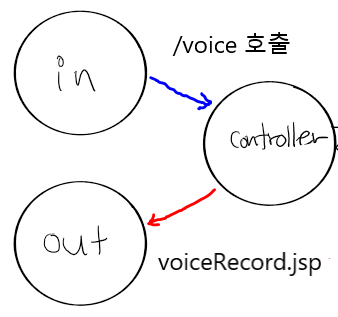
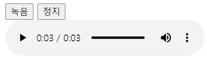
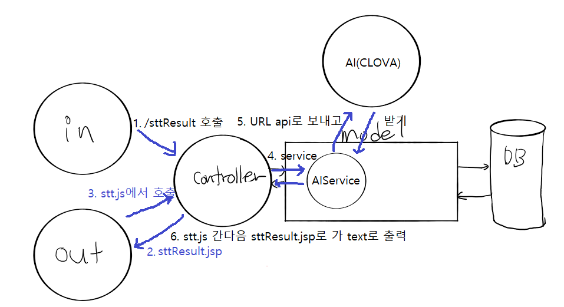

# CLOVA Speech Recognition

## 1. 음성 입력

> 사용자에게 녹음을 받고 녹음 파일을 제공



### 1. View



`voiceRecord.jsp`

> 사용자에게 녹음하고 정지하는 view를 제공


`voiceRecord.js`

> 동작부분을 제어하고 녹음 후 파일 저장


### 2. controller

`HomeController.java`

> URL 호출시 jsp와 연결시켜준다.

```java
	@RequestMapping(value = "/voice", method = RequestMethod.GET)
	public String voice(Locale locale, Model model) {
		
		
		return "voiceRecord";
	}
```


---


## 2. 음성 파일 보내기

> 음성파일을 Naver CLOVA Speech에 보내 번역된 결과를 받는다



### 1. View

`sttResult.jsp`

`stt.js`

> {"text":"안녕하세요"} -> 안녕하세요

```js
success:function(result){
	alert(result);
	data = JSON.parse(result);//text만 나오게 함
	$('#resultDiv').text(data.text);
},
```

한글설정

```js
$.ajax({
			type:"post",
			enctype:"multipart/form-data",
			contentType:"application/json; charset:UTF-8", //이부분
```


`jquery-3.6.0.min.js`


### 2. controller

`HomeController.java`

> `sttResult.jsp` 연결

```java
	@RequestMapping(value = "/sttResult", method = RequestMethod.GET)
	public String stt(Locale locale, Model model) {
		
		
		return "sttResult";
	}
```


`AIController.java`

> 한글설정 @RequestMapping("/clovaSTT")를 고친다.

```java
@Override
	//@RequestMapping("/clovaSTT")
	@RequestMapping(value="/clovaSTT", produces = "application/text; charset=UTF-8")//여기
	@ResponseBody
	public String stt(@RequestParam("uploadFile") MultipartFile file,
								@RequestParam("language") String language) {
		String result = "";
```


> C:/ai에 폴더 생성을 해야한다

```java
//1. 파일 저장 경로 설정 : 실제 서비스 되는 위치 (프로젝트 외부에 저장)
			  String uploadPath =  "c:/ai/";
```


> service 호출

```java
result = aiService.clovaSpeechToText(filePathName, language); 
```


### 3. service

`AIService.java`

```java
	@Override
	public String clovaSpeechToText(String filePathName, String language) {
		String clientId = "yls26ckxuy";             // Application Client ID";
        String clientSecret = "RORSMYPI4GSrsaWEW8gM0rli4IbbqexwhVsONbqO";     // Application Client Secret";
        String result = null; //result 선언
        //음성 파일 url로 보내는 작업
        try {
            String imgFile = filePathName;
            File voiceFile = new File(imgFile);

            //String language = "Kor";        // 언어 코드 ( Kor, Jpn, Eng, Chn )
            String apiURL = "https://naveropenapi.apigw.ntruss.com/recog/v1/stt?lang=" + language;
            URL url = new URL(apiURL);
            //기본 연결 작업
            HttpURLConnection conn = (HttpURLConnection)url.openConnection();
            conn.setUseCaches(false);
            conn.setDoOutput(true);
            conn.setDoInput(true);
            conn.setRequestProperty("Content-Type", "application/octet-stream");
            conn.setRequestProperty("X-NCP-APIGW-API-KEY-ID", clientId);
            conn.setRequestProperty("X-NCP-APIGW-API-KEY", clientSecret);
            //결과받는 작업
            OutputStream outputStream = conn.getOutputStream();
            FileInputStream inputStream = new FileInputStream(voiceFile);
            byte[] buffer = new byte[4096];
            int bytesRead = -1;
            while ((bytesRead = inputStream.read(buffer)) != -1) {
                outputStream.write(buffer, 0, bytesRead);
            }
            outputStream.flush();
            inputStream.close();
            BufferedReader br = null;
            int responseCode = conn.getResponseCode();
            if(responseCode == 200) { // 정상 호출
                br = new BufferedReader(new InputStreamReader(conn.getInputStream()));
            } else {  // 오류 발생
                System.out.println("error!!!!!!! responseCode= " + responseCode);
                br = new BufferedReader(new InputStreamReader(conn.getInputStream()));
            }
            //json코드로 바꾸는작업
            String inputLine;

            if(br != null) {
                StringBuffer response = new StringBuffer();
                while ((inputLine = br.readLine()) != null) {
                    response.append(inputLine);
                }
                br.close();
                System.out.println(response.toString());
                result = response.toString(); //result에 값을 넣고
            } else {
                System.out.println("error !!!");
            }
        } catch (Exception e) {
            System.out.println(e);
        }
		return result; //result로 리턴
	}
```


### 4. AI


### 5. 파일 업로드 관련 환경설정

*파일 업로드시 에러*

`servlet-context.xml`에 추가

```xml
<!-- 다중 파일 업로드  -->
		<dependency>
		   <groupId>commons-fileupload</groupId>
		   <artifactId>commons-fileupload</artifactId>
		   <version>1.2.1</version>
	 	</dependency>
	
		<dependency>
		   <groupId>commons-io</groupId>
		   <artifactId>commons-io</artifactId>
		   <version>1.4</version>
		</dependency> 
```


#### servlet-context.xml 추가 후 에러

*SEVERE: 웹 애플리케이션 [/spring-ai] 내의 서블릿 [appServlet]이(가) load() 예외를 발생시켰습니다.*
*java.lang.ClassNotFoundException: org.apache.commons.fileupload.FileItemFactory*


Maven에 jar파일을 추가 해야 하는데 대신 pom.xml에 dependency 추가

```xml
<!-- 다중 파일 업로드  -->
		<dependency>
		   <groupId>commons-fileupload</groupId>
		   <artifactId>commons-fileupload</artifactId>
		   <version>1.2.1</version>
	 	</dependency>
	
		<dependency>
		   <groupId>commons-io</groupId>
		   <artifactId>commons-io</artifactId>
		   <version>1.4</version>
		</dependency> 
```

