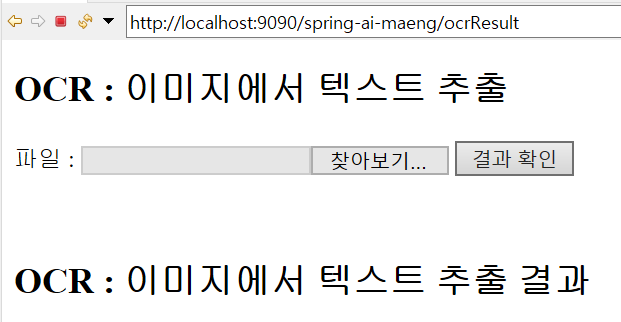
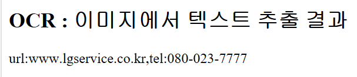
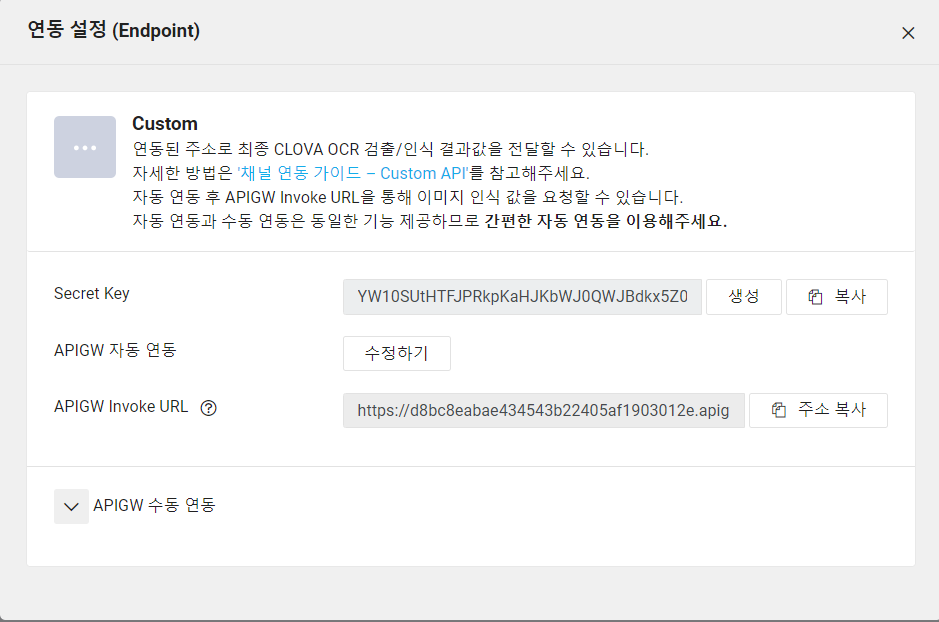
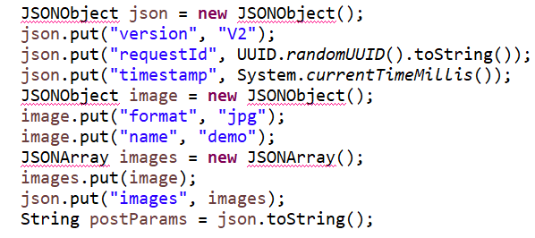

# CLOVA OCR


### 1. View



`ocrResult.jsp`

> resources/ 로 경로 수정

```jsp
<head>
		<meta charset="UTF-8">
		<title>OCR</title>
		<script src="<c:url value='resources/js/jquery-3.6.0.min.js'/>"></script>
		<script src="<c:url value='resources/js/ocr.js'/>"></script>
	</head>
```


`ocr.js`



> json으로 우리가 원하는 데이터만 뽑아내기

```js
			success:function(result){
				var data = JSON.parse(result);
				var field1 = (data.images[0].fields[0].name)+":"+data.images[0].fields[0].inferText;
				var field2 = (data.images[0].fields[1].name)+":"+data.images[0].fields[1].inferText;
				$('#resultDiv').text(field1+","+field2);
			},
```


### 2. controller

`HomeController.java`

> `ocrResult.jsp` 연결

```java
@RequestMapping(value = "/ocrResult", method = RequestMethod.GET)
	public String ocr(Locale locale, Model model) {
		
		
		return "ocrResult";
	}
```


`AIController.java`

> @Override /@ResponseBody 작성


> service 호출

```java
String result = "";
result = aiService.clovaOCRService(filePathName);
```


### 3. service

`AIService.java`

> controller에서 부터 만들면 된다!  -> service -> serviceImpl 순으로 만든 다음 코드 작성

설정>외부연동




```java
String apiURL = "~";
String secretKey = "~";
		String imageFile = filePathName;
```


> return값을 받기 위해 response변수를 try 밖으로 꺼내 선언한 다음 리턴값을 받는다.

```java
StringBuffer response = null;

...

	response = new StringBuffer();

...

return response.toString();
```


`writeMultiPart 메소드`

> java버전 1.7이상의 버전에 동작하는 코드여서 다음과 같이 바꾼다.
>
> file close를 자동적으로 처리해주는 부분이 지금 이클립스에서 안되서 고친거다.

```java
try {
				FileInputStream fis = new FileInputStream(file); 
				byte[] buffer = new byte[8192];
				int count;
				while ((count = fis.read(buffer)) != -1) {
					out.write(buffer, 0, count);
				}
				fis.close();
				out.write("\r\n".getBytes());
			} catch(Exception e) {
				System.out.println(e);
			}
```


### 4. AI


### 5. 나머지 환경설정

#### JSONObject 에러



Maven에 jar파일을 추가 해야 하는데 대신 pom.xml에 dependency 추가 후 service가서 import

```xml
<!-- JSON  --> 
		<dependency>
            <groupId>com.googlecode.json-simple</groupId>
            <artifactId>json-simple</artifactId>
            <version>1.1</version>
        </dependency>
		<dependency>
		    <groupId>org.json</groupId>
		    <artifactId>json</artifactId>
		    <version>20210307</version>
		</dependency>
```
