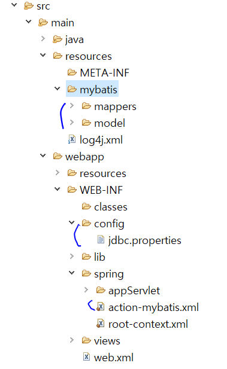

# MYSQL DB 연결하기




### jdbc.properties

```
jdbc.driverClassName=com.mysql.jdbc.Driver
jdbc.url=jdbc:mysql://localhost:3306/spring(db_name)
jdbc.username=root
jdbc.password=1234
```


### member.xml

안쓰는거 주석처리하고 특히 mysql에는 dual을 지원하지 않는다. 에러가 나므로 주석 처리 필.

```xml
close="SELECT * FROM DUAL" >
```


