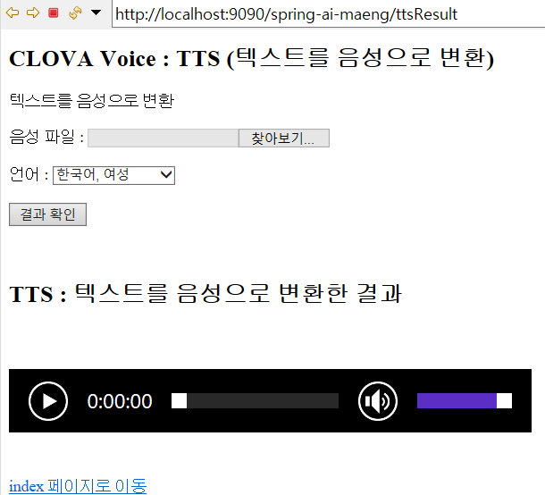

# chatbot

### 1. View



`ttsResult.jsp`

> resources/ 로 경로 확인

```jsp
<head>
		<meta charset="UTF-8">
		<title>OCR</title>
		<script src="<c:url value='resources/js/jquery-3.6.0.min.js'/>"></script>
		<script src="<c:url value='resources/js/tts.js'/>"></script>
	</head>
```


`tts.js`


> dataType 주석처리

```js
function callAjax(){
		$.ajax({
			type:"post",
			//dataType:'application/json;UTF-8',/*추가*/
```


### 2. controller

`HomeController.java`

> `ttsResult.jsp` 연결

```java
@RequestMapping(value = "/ttsResult", method = RequestMethod.GET)
	public String tts(Locale locale, Model model) {
		
		return "ttsResult";
	}
```


`AIController.java`

> service 호출 filepathName과 language넘겨줌

```java
result = aiService.clovaTextToSpeech(filePathName, language);
```


### 3. service

`AIService.java`

> controller에서 부터 만들면 된다!  -> service -> serviceImpl 순으로 만든 다음 코드 작성


`main메소드`

> api, scret값 설정

```java
String apiURL = "~";//애플리케이션 클라이언트 아이디값";
String clientSecret = "~";//애플리케이션 클라이언트 시크릿값";
```

`jsonToString 메소드`

> 안녕하세요 무엇을 도와드릴까요? 만 뽑아 주는 메소드

```java
public static String jsonToString(String jsonStr)
```

>

```java

```

> 

```java

```

> 

```java

```


### 4. AI


### 5. 나머지 환경설정

`server.xml`

> 

```xml

```


`servlet-context.xml`

> 

```xml

```


### 에러

`첫화면 나오기`

```
##1623211344087
##{"bubbles":[{"data":{"description":""},"type":"text"}],"event":"open","version":"v2","userId":"U47b00b58c90f8e47428af8b7bddc1231heo2","timestamp":1623211344087}
OK
class java.lang.String
```


