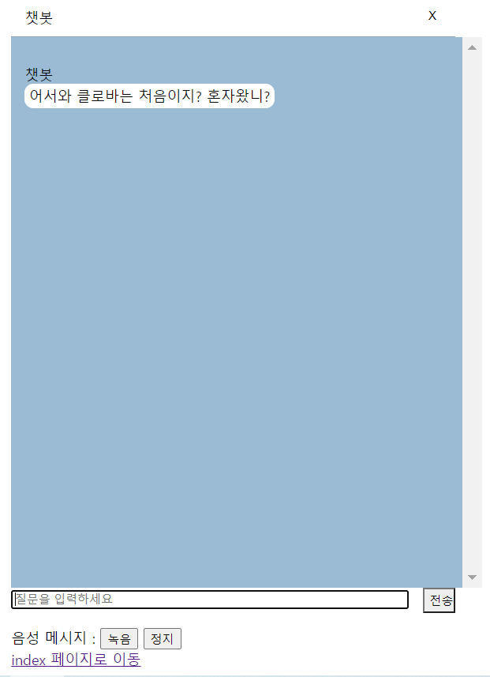

# chatbot

### 1. View



`chatForm.jsp`

> resources/ 로 경로 확인

```jsp
	<head> 
		<meta charset="UTF-8">
		<title> 챗봇 채팅창</title>
		<script src="<c:url value='resources/js/jquery-3.6.0.min.js'/>"></script>
		<script src="<c:url value='resources/js/chatbot2.js'/>"></script>
		<link rel="stylesheet" type="text/css" href="resources/css/chatbot.css">
	</head>
```


`chatbot.js`

> ajax를 활용해 음성 질문 녹음

```js
function callAjax(){
		$.ajax({
			type:"post",
			//dataType:'application/json;UTF-8',/*추가*/
```

> 서버에 업로드

> `function callAjax` 이미지/멀티링크 답변 포함된 답변 처리 

```js
url:"chatbotCall", // 일로 보내고 
			data:{message:$('#message').val()}, // 내가 전달한 메시지나 챗봇이 친 메시지
			success:function(result){	  //JSON 형식 그대로 받음
				result = JSON.parse(result); //parse 메소드는 string 객체를 JSON 객체로 변환시켜줌
				//alert(result);
				//console.log(result);
				var bubbles = result.bubbles; //"bubbles":[{"type":"text","data":{"description":"어서와 클로바는 처음이지? 혼자왔니?"} 가 드감
                bubbles[b].data.description //어서와 클로바는 처음이지? 혼자왔니?
```

```
{"version":"v2","userId":"U47b00b58c90f8e47428af8b7bddc1231heo2",

"timestamp":1623404086660,

"bubbles":[{"type":"text","data":{"description":"어서와 클로바는 처음이지? 혼자왔니?"},
		  //bubbles[a],    //bubbles[b]
"information":[{"key":"chatType","value":"TEXT"},{"key":"chatType","value":"TEXT"},{"key":"defaultMsgType","value":"welcomeMsg"},{"key":"welcomeMsgId","value":"2262"},{"key":"endOfBubble","value":"endOfBubble"}]}],
"entities":[],
"keywords":[],
"conversation":{"scenarioName":null,
"chatUtteranceSetId":null,
"types":[]},
"event":"send"}
```

[JSON에 대해 자세히](./spring/13_summary.md)


> 받은 텍스트 답변을 음성으로 변환

```js
/*받은 텍스트 답변을 음성으로 변환하기 위해 텍스트를 보내고 음성 파일 이름을 받아 실행*/
	function callAjaxTTS(result){
		$.ajax({
			type:"post",
			//dataType:'application/json;UTF-8',/*추가*/
			url:"chatbotTTS",
			data:{message:result},
			success:function(result){				
				$('audio').prop("src", '/ai/' + result)[0].play(); //result에 들어온 파일 이름의 오디오 실행
				//$('audio').hide();
			},
			error:function(e){
				alert("에러 발생 : " + e);
			}			
		});
		
	}
	
}); // $(function()  끝
```


### 2. controller

`HomeController.java`

> `ttsResult.jsp` 연결

```java
@RequestMapping(value = "/ttsResult", method = RequestMethod.GET)
	public String tts(Locale locale, Model model) {
		
		return "ttsResult";
	}
```


`AIController.java`

> service 호출 filepathName과 language넘겨줌

```java
result = aiService.clovaTextToSpeech(filePathName, language);
```


### 3. service

`AIService.java`

> controller에서 부터 만들면 된다!  -> service -> serviceImpl 순으로 만든 다음 코드 작성


`main메소드`

> api, scret값 설정

```java
String apiURL = "~";//애플리케이션 클라이언트 아이디값";
String clientSecret = "~";//애플리케이션 클라이언트 시크릿값";
```

`jsonToString 메소드`

> 안녕하세요 무엇을 도와드릴까요? 만 뽑아 주는 메소드

```java
public static String jsonToString(String jsonStr)
```

>

```java

```

> 

```java

```

> 

```java

```


### 4. AI


### 5. 나머지 환경설정

`server.xml`

> 파일 paht 지정

```xml
<Context docBase="c:\\ai\\" path="/ai" reloadable="tr
```


`servlet-context.xml`

> 파일 paht 지정
>
> 멀티파트 리졸버 : https://passionha.tistory.com/214

```xml
<resources mapping="/ai/**" location="c:\\ai\\" />

<!-- 멀티파트 리졸버 -->
    <beans:bean id="multipartResolver"  class="org.springframework.web.multipart.commons.CommonsMultipartResolver">
       <beans:property name="maxUploadSize" value="52428800" />
       <beans:property name="maxInMemorySize" value="1000000" />
       <beans:property name="defaultEncoding" value="utf-8" />
    </beans:bean>
```

`pom.xml`

>JSON, 다중파일 설정

```xml
<!-- JSON  --> 
		<dependency>
            <groupId>com.googlecode.json-simple</groupId>
            <artifactId>json-simple</artifactId>
            <version>1.1</version>
        </dependency>
		<dependency>
		    <groupId>org.json</groupId>
		    <artifactId>json</artifactId>
		    <version>20210307</version>
		</dependency>
		<!-- 다중 파일 업로드  -->
		<dependency>
		   <groupId>commons-fileupload</groupId>
		   <artifactId>commons-fileupload</artifactId>
		   <version>1.2.1</version>
	 	</dependency>
	
		<dependency>
		   <groupId>commons-io</groupId>
		   <artifactId>commons-io</artifactId>
		   <version>1.4</version>
		</dependency>
```


### 에러

> `첫화면 나오기` 네이버 API chatbot 설정 문제시 다음과 같이 연결은 되어도 동작을 하지 않는다

```
##1623211344087
##{"bubbles":[{"data":{"description":""},"type":"text"}],"event":"open","version":"v2","userId":"U47b00b58c90f8e47428af8b7bddc1231heo2","timestamp":1623211344087}
OK
class java.lang.String
```


